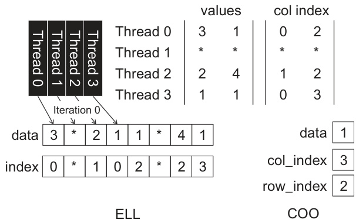

## Regularização em SpMV via Remoção de Elementos em Formatos Híbridos ELL e COO

### Introdução

Ao abordar a multiplicação esparsa matriz-vetor (SpMV) em GPUs, a escolha do formato de armazenamento da matriz esparsa desempenha um papel crucial no desempenho. O formato ELL (Ellpack-Itpack) é eficiente quando a matriz possui uma distribuição razoavelmente uniforme de elementos não nulos por linha. No entanto, para matrizes com grande variação no número de elementos não nulos por linha, o formato ELL pode se tornar ineficiente devido ao *padding* excessivo com zeros, o que desperdiça memória e largura de banda. Para mitigar esses problemas, formatos híbridos que combinam ELL com outros formatos, como COO (Coordinate list), são frequentemente empregados. Este capítulo explorará como a remoção seletiva de elementos do formato ELL e sua realocação para o formato COO pode ser vista como uma forma de técnica de regularização.

### Conceitos Fundamentais

O formato ELL é adequado para matrizes esparsas com distribuição relativamente uniforme de não-zeros por linha. Ele armazena os valores não nulos e os índices de coluna correspondentes em duas matrizes retangulares. Se uma linha tem menos elementos não nulos do que o número máximo de elementos não nulos em qualquer linha, ela é preenchida com zeros (padding). Este *padding* excessivo pode levar a ineficiências significativas em termos de uso de memória e desempenho computacional.

O formato COO, por outro lado, armazena a matriz esparsa como uma lista de tuplas (linha, coluna, valor). Ele é flexível e pode representar eficientemente matrizes com distribuições arbitrárias de não-zeros. No entanto, o acesso aleatório aos elementos pode ser uma desvantagem em termos de desempenho na GPU.

A combinação desses formatos, ou seja, um formato híbrido ELL/COO, visa aproveitar as vantagens de ambos os formatos. O objetivo é usar o ELL para a parte da matriz que é bem comportada (linhas com um número próximo de não-zeros) e o COO para os elementos restantes (linhas com um número significativamente maior de não-zeros do que a média).

### Regularização via Remoção de Elementos

A decisão de remover alguns elementos do formato ELL e colocá-los no formato COO pode ser vista como uma forma de regularização. Regularização, no contexto de aprendizado de máquina e otimização, é uma técnica utilizada para evitar o *overfitting* e melhorar a generalização do modelo. Ela envolve adicionar uma penalidade à função objetivo que desencoraja soluções complexas.

No contexto de SpMV com formatos híbridos, a "complexidade" pode ser entendida como o *padding* excessivo no formato ELL. Ao remover elementos do ELL e colocá-los no COO, estamos efetivamente reduzindo o *padding* e, portanto, diminuindo a "complexidade" da representação da matriz.

Mais formalmente, considere que o custo de executar SpMV com o formato ELL é proporcional ao número total de elementos armazenados, incluindo os zeros de *padding*. Seja $C_{ELL}$ esse custo. O objetivo é minimizar $C_{ELL}$, mas sujeito a uma restrição: que a precisão do cálculo SpMV seja mantida em um nível aceitável. Ao mover elementos para o formato COO, introduzimos um custo adicional $C_{COO}$ associado ao acesso e processamento desses elementos. No entanto, a redução em $C_{ELL}$ pode compensar esse custo adicional, resultando em um custo total menor:

$$C_{total} = C_{ELL} + C_{COO}$$

A escolha de quais elementos remover do ELL para o COO é análoga à escolha de quais parâmetros regularizar em um modelo de aprendizado de máquina. Podemos aplicar diferentes critérios para essa escolha, como remover os elementos de linhas com o maior número de não-zeros, ou usar uma métrica mais sofisticada que leva em consideração a estrutura da matriz e o padrão de acesso à memória.

**Analogia com Regularização L1 e L2:**

- A remoção de elementos pode ser comparada à **regularização L1**, onde alguns parâmetros são zerados para simplificar o modelo. Da mesma forma, remover elementos do formato ELL implica em "zerar" esses elementos nesse formato, transferindo-os para o COO.
- Manter alguns elementos no formato ELL, mesmo que isso resulte em um pequeno *padding*, pode ser comparado à **regularização L2**, onde os parâmetros são reduzidos em magnitude, mas não zerados completamente. Isso ajuda a evitar o *overfitting* sem eliminar completamente a informação contida nesses parâmetros.

### Conclusão

A remoção seletiva de elementos do formato ELL e sua transferência para o formato COO em formatos híbridos para SpMV pode ser vista como uma técnica de regularização. Essa abordagem visa reduzir a "complexidade" da representação da matriz esparsa, minimizando o *padding* excessivo e melhorando o desempenho computacional. A escolha de quais elementos remover e colocar no COO é análoga à escolha de quais parâmetros regularizar em um modelo de aprendizado de máquina, permitindo um controle fino sobre o trade-off entre precisão e desempenho. A análise do custo total, $C_{total} = C_{ELL} + C_{COO}$, é fundamental para determinar a estratégia de regularização ideal para uma dada matriz esparsa e arquitetura de GPU.

### Referências
<!-- END -->