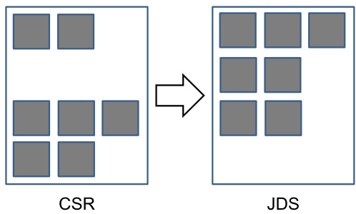

## Otimização SpMV: Ordenação e Particionamento para Redução de Padding em ELL e JDS

### Introdução

A multiplicação esparsa de matriz por vetor (SpMV) é uma operação fundamental em diversas aplicações científicas e de engenharia. O formato ELL (Ellpack/Itpack) é uma representação comum para matrizes esparsas, particularmente adequado para GPUs devido à sua estrutura regular que facilita o acesso à memória coalescente. No entanto, o formato ELL pode sofrer com o overhead de *padding* quando as linhas da matriz têm comprimentos significativamente variáveis. Para mitigar este problema, técnicas de ordenação e particionamento de linhas com base no seu comprimento podem ser aplicadas, resultando em uma representação mais eficiente, como o formato JDS (Jagged Diagonal Storage). Este capítulo explora em profundidade o uso da ordenação e particionamento para otimizar o SpMV, com foco na redução do *padding* no formato ELL e na transição para o formato JDS.

### Conceitos Fundamentais

**Padding em ELL e sua Otimização**

O formato ELL representa uma matriz esparsa armazenando os valores não-zero e seus respectivos índices de coluna em duas matrizes retangulares. Cada linha dessas matrizes corresponde a uma linha da matriz esparsa original. O número de colunas é determinado pelo comprimento máximo de linha na matriz esparsa. Linhas com menos elementos que o comprimento máximo são preenchidas com valores *dummy*, geralmente zeros, para garantir que todas as linhas tenham o mesmo comprimento. Este processo de preenchimento é conhecido como *padding* e pode levar a um desperdício significativo de memória e computação, especialmente se a variação nos comprimentos das linhas for grande.


Para reduzir o overhead de *padding* no formato ELL, uma estratégia eficaz é ordenar as linhas da matriz esparsa em ordem decrescente de comprimento. Ao fazer isso, as linhas mais longas são processadas primeiro, e o *padding* nas linhas subsequentes é minimizado. Esta abordagem permite uma melhor utilização da memória e uma redução no número de operações desnecessárias realizadas com os valores *dummy*.

**Jagged Diagonal Storage (JDS)**

O formato JDS é uma extensão do formato ELL que incorpora a ordenação das linhas por comprimento. A principal diferença é que o JDS armazena explicitamente os índices originais das linhas após a ordenação, permitindo reconstruir a matriz original quando necessário. Isso é feito através de um array adicional, `jds_row_index`, que mapeia as linhas ordenadas de volta para suas posições originais na matriz esparsa.



A estrutura JDS consiste em:

*   `jds_val`: Um array contendo os valores não-zero da matriz, armazenados linha por linha, com as linhas ordenadas por comprimento.
*   `jds_col_index`: Um array contendo os índices de coluna correspondentes aos valores em `jds_val`.
*   `jds_row_index`: Um array que mapeia as linhas ordenadas de volta para seus índices originais na matriz esparsa.

**Implementação da Ordenação e Particionamento**

A ordenação das linhas por comprimento pode ser implementada usando algoritmos de ordenação eficientes, como *radix sort* ou *merge sort*. A escolha do algoritmo depende do tamanho da matriz e das características da arquitetura da GPU.

Após a ordenação, a matriz pode ser particionada em blocos, onde cada bloco contém linhas de comprimento semelhante. Isso permite uma granularidade ainda maior no controle do *padding*, já que o *padding* é aplicado apenas dentro de cada bloco, e não em toda a matriz.

A criação do array `jds_row_index` é crucial para preservar a informação da estrutura original da matriz. Este array deve ser construído durante o processo de ordenação, registrando o índice original de cada linha antes que ela seja movida para sua nova posição ordenada.

**Algoritmo SpMV com JDS**

O algoritmo SpMV utilizando o formato JDS envolve os seguintes passos:

1.  **Iterar sobre as linhas ordenadas:** Percorrer as linhas da matriz armazenada em `jds_val` e `jds_col_index`.
2.  **Acessar o vetor:** Para cada elemento não-zero na linha atual, acessar o elemento correspondente no vetor de entrada usando o índice de coluna armazenado em `jds_col_index`.
3.  **Realizar a multiplicação e acumulação:** Multiplicar o valor não-zero pelo elemento correspondente do vetor e acumular o resultado em um acumulador local.
4.  **Escrever o resultado:** Após processar todos os elementos não-zero na linha, escrever o valor do acumulador no elemento correspondente do vetor de saída. O índice do elemento no vetor de saída é determinado pelo array `jds_row_index`.


**Exemplo Prático**

Considere a seguinte matriz esparsa:

```
A = [
    [1, 0, 2, 0, 3],
    [0, 4, 0, 5, 0],
    [6, 0, 0, 0, 0],
    [0, 7, 8, 0, 9]
]
```

Após a ordenação das linhas por comprimento, a matriz pode ser reorganizada como:

```
A_sorted = [
    [1, 0, 2, 0, 3],
    [0, 7, 8, 0, 9],
    [0, 4, 0, 5, 0],
    [6, 0, 0, 0, 0]
]
```

O formato JDS para esta matriz seria:

*   `jds_val`: `[1, 2, 3, 7, 8, 9, 4, 5, 6]`
*   `jds_col_index`: `[0, 2, 4, 1, 2, 4, 1, 3, 0]`
*   `jds_row_index`: `[0, 3, 1, 2]`

Observe que `jds_row_index` mapeia a primeira linha de `A_sorted` (índice 0) para a primeira linha de `A`, a segunda linha de `A_sorted` (índice 1) para a quarta linha de `A`, e assim por diante.

### Conclusão

A ordenação e particionamento de linhas com base no comprimento são técnicas eficazes para reduzir o overhead de *padding* no formato ELL e melhorar o desempenho do SpMV em GPUs. O formato JDS, que incorpora a ordenação e armazena os índices originais das linhas, permite uma representação mais compacta e eficiente da matriz esparsa, especialmente quando a variação nos comprimentos das linhas é significativa. A escolha do algoritmo de ordenação e a estratégia de particionamento dependem das características da matriz esparsa e da arquitetura da GPU, sendo necessário realizar experimentos para determinar a configuração ideal para cada caso. A consideração destas otimizações é crucial para o desenvolvimento de kernels SpMV de alto desempenho em CUDA.

### Referências
[^1]: "Sorting and partitioning rows based on length can further reduce padding overhead in ELL. This results in a `jds_row_index` array to preserve original row indices during sorting."

<!-- END -->