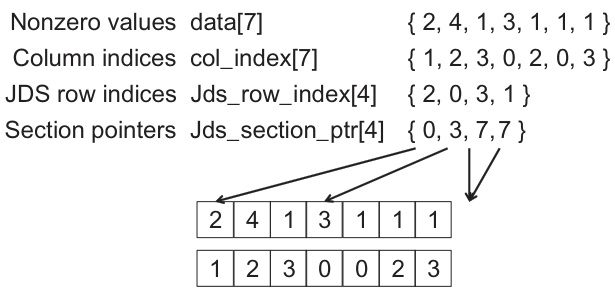
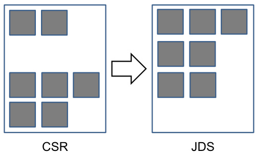

## Representação JDS e Lançamento de Kernels SpMV no Host

### Introdução

A implementação eficiente de operações SpMV (Sparse Matrix-Vector Multiplication) em GPUs requer a conversão da matriz esparsa para um formato adequado para processamento paralelo. Como discutido em seções anteriores, o formato JDS (Jagged Diagonal Storage) oferece vantagens significativas em termos de balanceamento de carga e acesso coalescido à memória. Este capítulo detalha a criação da representação JDS no código host e o lançamento dos kernels SpMV para cada seção da matriz.

### Conceitos Fundamentais

A representação JDS [^4] reordena os elementos não nulos da matriz esparsa original, agrupando-os por diagonais. O objetivo é maximizar o paralelismo e a coalescência de memória durante a computação do SpMV. O processo envolve as seguintes etapas:

1.  **Determinação do Número Máximo de Elementos Não Nulos por Linha:** Identificar o número máximo de elementos não nulos presentes em qualquer linha da matriz esparsa. Este valor define o tamanho da maior diagonal na representação JDS.
2.  **Permutação de Linhas:** Reordenar as linhas da matriz de acordo com o número de elementos não nulos em ordem decrescente. Linhas com um maior número de elementos não nulos são colocadas no início da representação JDS.
3.  **Construção das Estruturas de Dados JDS:** Criar as estruturas de dados necessárias para armazenar a matriz no formato JDS. Isso geralmente envolve dois arrays principais: `JDS_values` e `JDS_columns`. O array `JDS_values` armazena os valores dos elementos não nulos, enquanto `JDS_columns` armazena os índices das colunas correspondentes. Um terceiro array, `JDS_row_ptrs`, pode ser utilizado para indicar o início de cada "diagonal" no `JDS_values` e `JDS_columns`.
4.  **Particionamento:** Dividir a matriz JDS em seções menores para melhor utilização dos recursos da GPU e balanceamento de carga. Cada seção é processada por um kernel SpMV separado.

### Implementação no Host

O código host é responsável por realizar as seguintes tarefas:

1.  **Alocação de Memória:** Alocar memória na CPU para armazenar a matriz esparsa original, a representação JDS e os vetores de entrada e saída.
2.  **Conversão para JDS:** Implementar a lógica para converter a matriz esparsa original para a representação JDS. Isso inclui a reordenação das linhas e a construção dos arrays `JDS_values`, `JDS_columns` e, opcionalmente, `JDS_row_ptrs`.
3.  **Particionamento da Matriz:** Dividir a matriz JDS em seções menores com base em critérios como o número de elementos não nulos ou o tamanho da memória disponível na GPU. A escolha do esquema de particionamento impacta diretamente o desempenho do SpMV.
4.  **Transferência de Dados para a GPU:** Transferir as seções da matriz JDS e o vetor de entrada para a memória da GPU.
5.  **Lançamento dos Kernels SpMV:** Lançar um kernel SpMV para cada seção da matriz JDS. É crucial configurar corretamente os parâmetros de lançamento do kernel, como o número de blocos e o número de threads por bloco, para otimizar a utilização da GPU.
6.  **Transferência de Resultados da GPU:** Transferir o vetor de saída resultante de volta para a CPU.
7.  **Liberação de Memória:** Liberar a memória alocada na CPU e na GPU.

#### Detalhes da Conversão para JDS

A conversão da matriz esparsa original para o formato JDS é uma etapa crítica. A complexidade desta etapa reside na reordenação das linhas e na construção eficiente dos arrays `JDS_values` e `JDS_columns`. Um possível algoritmo para a conversão é o seguinte:

1.  **Contagem de Elementos Não Nulos por Linha:** Percorrer todas as linhas da matriz esparsa original e armazenar o número de elementos não nulos em cada linha em um array auxiliar.
2.  **Ordenação das Linhas:** Ordenar as linhas da matriz esparsa original com base no número de elementos não nulos em ordem decrescente. Isso pode ser feito usando algoritmos de ordenação como quicksort ou mergesort.
3.  **Construção dos Arrays JDS:** Percorrer as linhas ordenadas e preencher os arrays `JDS_values` e `JDS_columns` de acordo com a estrutura JDS. O array `JDS_row_ptrs` pode ser usado para indicar o início de cada "diagonal".

#### Particionamento da Matriz JDS

O particionamento da matriz JDS envolve a divisão da matriz em seções menores. Diferentes estratégias de particionamento podem ser empregadas:

*   **Particionamento Estático:** Dividir a matriz em seções de tamanho fixo. Esta abordagem é simples, mas pode levar a um balanceamento de carga subótimo se as seções tiverem um número significativamente diferente de elementos não nulos.
*   **Particionamento Dinâmico:** Dividir a matriz em seções com base no número de elementos não nulos em cada seção. Esta abordagem visa balancear a carga entre as seções, mas requer uma análise prévia da distribuição dos elementos não nulos.

#### Lançamento dos Kernels SpMV

Para cada seção da matriz JDS, um kernel SpMV é lançado na GPU. O kernel SpMV recebe como entrada a seção da matriz JDS (arrays `JDS_values` e `JDS_columns`), o vetor de entrada e o vetor de saída. O kernel calcula o produto matriz-vetor para a seção correspondente e armazena o resultado no vetor de saída.

É fundamental otimizar o kernel SpMV para garantir um alto desempenho. Técnicas de otimização incluem:

*   **Acesso Coalescido à Memória:** Garantir que os threads acessem a memória global da GPU de forma coalescida para maximizar a largura de banda.
*   **Utilização da Memória Compartilhada:** Usar a memória compartilhada da GPU para armazenar dados acessados frequentemente, reduzindo a latência.
*   **Otimização do Loop Interno:** Otimizar o loop interno do kernel SpMV para reduzir o número de operações e aumentar o paralelismo.

### Conclusão

A criação da representação JDS no código host e o lançamento dos kernels SpMV para cada seção são passos cruciais na implementação eficiente de operações SpMV em GPUs. A escolha adequada do esquema de particionamento, a otimização do kernel SpMV e o gerenciamento eficiente da memória são fatores determinantes para o desempenho final. A representação JDS permite explorar o paralelismo inerente às matrizes esparsas, possibilitando a aceleração significativa de aplicações científicas e de engenharia que utilizam SpMV como um componente central.

### Referências

[^4]: Discussão sobre o formato JDS e suas propriedades.
<!-- END -->