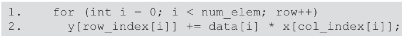

## Compressed Sparse Row (CSR) Format for Sparse Matrix Storage

### Introdução
O formato Compressed Sparse Row (CSR) é uma técnica fundamental para a representação eficiente de matrizes esparsas, especialmente em computação de alto desempenho e processamento paralelo em GPUs com CUDA. Dada a prevalência de matrizes esparsas em diversas áreas como simulações físicas, redes neurais e análise de grafos, a escolha de um formato de armazenamento adequado impacta significativamente o desempenho das operações matriciais. Este capítulo se dedica à exploração do formato CSR, detalhando sua estrutura, vantagens e desvantagens, bem como considerações práticas para sua implementação eficiente em CUDA.

### Conceitos Fundamentais

O formato CSR visa reduzir o espaço de armazenamento necessário para matrizes esparsas, armazenando apenas os elementos não nulos juntamente com informações sobre suas posições. Ao invés de armazenar a matriz completa, que conteria muitos zeros, o CSR utiliza três arrays para representar a matriz: `data[]`, `col_index[]` e `row_ptr[]` [^1].

1.  **`data[]`**: Este array armazena os valores dos elementos não nulos da matriz esparsa, varrendo a matriz linha por linha. Assim, se o elemento $a_{ij}$ é não nulo, seu valor é armazenado em `data[]`.

2.  **`col_index[]`**: Este array armazena os índices das colunas correspondentes aos valores armazenados em `data[]`. Ou seja, se `data[k]` contém o valor do elemento na coluna *j*, então `col_index[k] = j`.

3.  **`row_ptr[]`**: Este array armazena os índices que indicam o início de cada linha no array `data[]`. Formalmente, `row_ptr[i]` armazena o índice no array `data[]` onde a *i*-ésima linha da matriz começa. A última entrada `row_ptr[n]`, onde *n* é o número de linhas da matriz, armazena o índice do final dos dados da última linha (ou o tamanho total do array `data[]`), servindo como um marcador de fim para simplificar os cálculos de índice. `row_ptr[n]` armazena a localização de uma linha não existente para conveniência [^1].

**Exemplo:**

Considere a seguinte matriz esparsa 4x4:

$$
A = \begin{bmatrix}
1 & 0 & 2 & 0 \\
0 & 3 & 0 & 4 \\
5 & 0 & 6 & 0 \\
0 & 7 & 0 & 8
\end{bmatrix}
$$

A representação CSR desta matriz seria:

*   `data[]` = \[1, 2, 3, 4, 5, 6, 7, 8]
*   `col_index[]` = \[0, 2, 1, 3, 0, 2, 1, 3]
*   `row_ptr[]` = \[0, 2, 4, 6, 8]

**Análise e Vantagens:**

O formato CSR oferece uma redução significativa no espaço de armazenamento em comparação com a representação tradicional de matrizes densas, especialmente para matrizes com alta esparsidade [^1]. A principal vantagem reside na capacidade de armazenar apenas os elementos não nulos e seus respectivos índices, eliminando a necessidade de armazenar os zeros.

Outra vantagem importante é a eficiência em operações que percorrem as linhas da matriz, como a multiplicação matriz-vetor (*SpMV*). O array `row_ptr[]` permite acesso direto ao início dos elementos não nulos de cada linha, facilitando a iteração e o cálculo dos produtos internos.

**Desvantagens:**

Apesar de suas vantagens, o formato CSR também apresenta algumas desvantagens. A principal delas é a sobrecarga introduzida pelos arrays de índices (`col_index[]` e `row_ptr[]`) [^1]. Embora o armazenamento dos elementos não nulos seja reduzido, o armazenamento adicional dos índices pode, em alguns casos, aumentar o tamanho total dos dados, especialmente para matrizes com baixa esparsidade.

Além disso, a inserção ou remoção de elementos não nulos em uma matriz CSR pode ser uma operação custosa, pois requer a realocação e o rearranjo dos arrays `data[]`, `col_index[]` e `row_ptr[]`. Portanto, o formato CSR é mais adequado para matrizes esparsas que sofrem poucas modificações após a sua criação.

**Considerações para Implementação em CUDA:**

Ao implementar o formato CSR em CUDA para GPUs, é crucial considerar a organização da memória e o paralelismo. A memória global da GPU é relativamente lenta, e o acesso não coalescido pode levar a gargalos de desempenho. Portanto, é importante garantir que os arrays `data[]`, `col_index[]` e `row_ptr[]` sejam armazenados de forma coalescida na memória global.

Além disso, o paralelismo pode ser explorado na multiplicação matriz-vetor (SpMV) dividindo as linhas da matriz entre os threads da GPU. Cada thread pode calcular o produto interno de uma ou mais linhas da matriz com o vetor, e os resultados podem ser combinados para obter o vetor resultante. A escolha do número de threads por bloco e do número de blocos deve ser cuidadosamente considerada para otimizar o desempenho.

### Conclusão

O formato CSR é uma técnica essencial para o armazenamento eficiente de matrizes esparsas, oferecendo uma redução significativa no espaço de armazenamento e otimização de operações como a multiplicação matriz-vetor. Apesar de apresentar algumas desvantagens, como a sobrecarga dos arrays de índices e a dificuldade na inserção/remoção de elementos, suas vantagens superam suas limitações em muitas aplicações. A implementação eficiente do formato CSR em CUDA requer atenção à organização da memória e ao paralelismo para obter o máximo desempenho nas GPUs. <!-- END -->
[^1]: The Compressed Sparse Row (CSR) format is a widely used method for storing sparse matrices. It uses three arrays: `data[]` (nonzero values), `col_index[]` (column indices), and `row_ptr[]` (starting location of each row, with `row_ptr[5]` storing the location of a nonexisting row for convenience). CSR reduces storage but introduces overhead with index arrays.
<!-- END -->