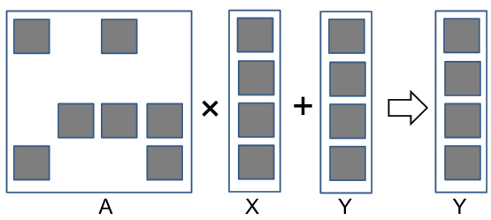
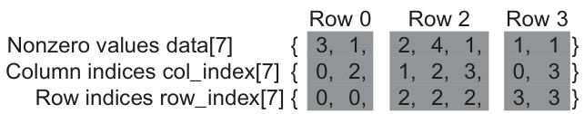
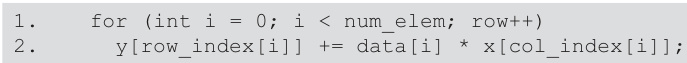
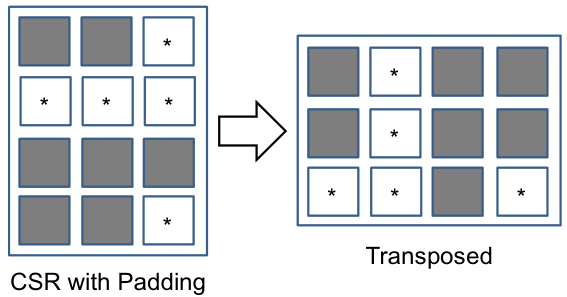
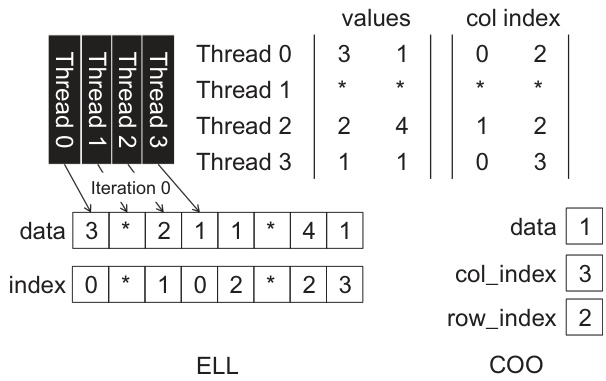

## Métodos Iterativos para Sistemas Lineares Esparsos e a Importância de SpMV

### Introdução

Este capítulo aprofunda a discussão sobre a solução de sistemas lineares esparsos, com foco particular na relevância crucial da operação **SpMV** (Sparse Matrix-Vector Multiplication) dentro dos métodos iterativos. Como discutido anteriormente, o armazenamento eficiente e a manipulação de matrizes esparsas são fundamentais para otimizar o desempenho computacional [^1]. Agora, exploraremos como essa otimização se manifesta especificamente no contexto da resolução de sistemas lineares.

### Conceitos Fundamentais

A solução de sistemas lineares na forma $Ax = b$, onde $A$ é uma matriz esparsa de dimensão $n \times n$, $x$ é o vetor de incógnitas e $b$ é o vetor de termos independentes, é um problema fundamental em diversas áreas da ciência e engenharia. Quando $A$ é esparsa, métodos diretos como a eliminação de Gauss podem se tornar proibitivamente caros devido ao *fill-in*, o fenômeno onde elementos originalmente zero se tornam não-zero durante a decomposição. Métodos iterativos, por outro lado, oferecem uma alternativa viável, especialmente para matrizes de grande porte [^1].

**Métodos Iterativos:** Métodos iterativos geram uma sequência de aproximações $x_k$ que convergem para a solução $x$ [^1]. Exemplos comuns incluem o método de **Jacobi**, o método de **Gauss-Seidel**, o método do **Gradiente Conjugado** (CG) e o método **GMRES** (Generalized Minimal Residual). A escolha do método iterativo depende das propriedades da matriz $A$, como simetria, positividade definida e diagonal dominância.

**Gradiente Conjugado (CG):** Para matrizes simétricas e positivas definidas, o método do gradiente conjugado é uma escolha popular devido à sua rápida convergência. O método CG minimiza a função quadrática

$$
\phi(x) = \frac{1}{2}x^T A x - b^T x
$$

iterativamente. Cada iteração do CG envolve tipicamente as seguintes operações:

1.  Multiplicação matriz-vetor: $Ap_k$, onde $p_k$ é a direção de busca na iteração $k$.
2.  Produtos internos: $\langle r_k, r_k \rangle$ e $\langle p_k, Ap_k \rangle$, onde $r_k$ é o resíduo na iteração $k$.
3.  Atualizações de vetores: $x_{k+1} = x_k + \alpha_k p_k$ e $r_{k+1} = r_k - \alpha_k Ap_k$, onde $\alpha_k$ é o tamanho do passo.
4.  Atualização da direção de busca: $p_{k+1} = r_{k+1} + \beta_k p_k$, onde $\beta_k$ é um escalar.

**A Relevância de SpMV:** Observa-se que a multiplicação matriz-vetor $Ap_k$ é a operação computacionalmente mais intensiva dentro de cada iteração do método CG, especialmente para matrizes esparsas de grande porte [^1]. Esta operação é a **SpMV**. Portanto, a eficiência da implementação de SpMV tem um impacto direto e significativo no tempo total de resolução do sistema linear. Qualquer otimização em SpMV se traduzirá em uma melhoria substancial no desempenho geral do método iterativo.

A complexidade da operação SpMV depende do número de elementos não-nulos na matriz $A$. Se $nnz(A)$ representa o número de elementos não-nulos, a complexidade de SpMV é $O(nnz(A))$ [^1]. Em contraste, a complexidade da multiplicação matriz-vetor densa é $O(n^2)$, onde $n$ é a dimensão da matriz. Para matrizes esparsas, $nnz(A) \ll n^2$, tornando SpMV muito mais eficiente do que a multiplicação densa.

**Formatos de Armazenamento e SpMV:** A escolha do formato de armazenamento da matriz esparsa influencia diretamente a eficiência da operação SpMV. Formatos como **CSR** (Compressed Sparse Row) e **CSC** (Compressed Sparse Column) são comumente utilizados [^1]. O formato CSR é particularmente adequado para SpMV, pois permite um acesso eficiente aos elementos não-nulos de cada linha da matriz. A implementação da SpMV utilizando o formato CSR envolve iterar sobre as linhas da matriz, e para cada linha, iterar sobre os elementos não-nulos daquela linha, multiplicando-os pelos elementos correspondentes do vetor e acumulando o resultado.

**Otimizações de SpMV:** Dada a importância crítica de SpMV, várias técnicas de otimização têm sido desenvolvidas, incluindo:

*   **Reordenação de matrizes:** Reordenar as linhas e colunas da matriz pode melhorar a localidade dos dados e reduzir o número de acessos à memória.
*   **Blocking:** Dividir a matriz em blocos menores e realizar a multiplicação bloco a bloco pode melhorar o uso do cache.
*   **Vectorização:** Utilizar instruções SIMD (Single Instruction, Multiple Data) para realizar múltiplas multiplicações e adições simultaneamente.
*   **Paralelização:** Distribuir a computação entre múltiplos processadores ou threads para acelerar a execução. A paralelização em GPUs é particularmente interessante devido ao seu alto poder de processamento paralelo [^1].

Exemplo de um loop sequencial simples para multiplicação SpMV usando o formato CSR:

Outros formatos de armazenamento, como ELLPACK (ELL) e Jagged Diagonal Storage (JDS) também podem ser empregados, cada com suas vantagens para casos específicos:

 Abordagens hibridas também são empregadas para lidar com matrizes com diferentes estruturas de esparsidade, como a combinação de formatos ELL e COO:

### Conclusão

A solução de sistemas lineares esparsos utilizando métodos iterativos depende fortemente da eficiência da operação SpMV. Melhorias no desempenho de SpMV, através da escolha de formatos de armazenamento adequados e da aplicação de técnicas de otimização, têm um impacto significativo no tempo total de resolução do sistema. O método do gradiente conjugado serve como um exemplo paradigmático, ilustrando como a otimização de SpMV se traduz em uma convergência mais rápida e, portanto, em um desempenho superior na solução de problemas práticos.

### Referências
[^1]: Informações fornecidas no contexto.
<!-- END -->