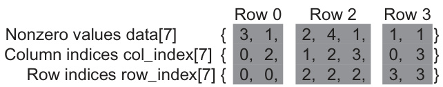

This image, found in Chapter 10 of the document, illustrates a hybrid ELL (Ellpack) and COO (Coordinate) method for SpMV (Sparse Matrix-Vector Multiplication), as described in section 10.4. The image showcases how non-zero elements from rows with excessive non-zero elements in the ELL format are moved to a separate COO format, reducing padding and improving performance by balancing workload across threads. This approach leverages the strengths of both ELL (memory coalescing) and COO (flexibility in handling irregular data distributions).

The image illustrates the ELL (Ellpack) format after transposition and padding, as discussed in Section 10.3 of the document. It shows how threads are mapped to rows of a sparse matrix and how padding (represented by '*') is added to make each row have the same number of elements. The data and index arrays below demonstrate the column-major storage and how elements are reordered after transposition to improve memory access patterns.

This image, found on page 3 as Figure 10.2, illustrates the Compressed Sparse Row (CSR) storage format for a sparse matrix. The image shows the data array containing non-zero values, the col_index array indicating the column indices of these values, and the row_index array indicating the row indices for each non-zero value; the CSR format efficiently compresses sparse matrices by storing only non-zero elements along with their row and column indices, reducing memory consumption.

This image, labeled as Figure 10.8 in the document, illustrates the concept of padding and transposition in sparse matrix storage, specifically within the context of the ELL (ELLPACK) format, as described on page 224. The image contrasts the CSR (Compressed Sparse Row) format with padding, where 'dummy' zero elements are added (indicated by asterisks) to make all rows the same length, and the subsequent transposition of the padded matrix for column-major order layout, which addresses issues of non-coalesced memory access and control divergence in parallel SpMV/CSR kernels.

The image, referenced as Figure 10.3 in Chapter 10 of the document, illustrates a small example of sparse matrix-vector multiplication and accumulation. It depicts a sparse matrix 'A' multiplied by a vector 'X', with the result added to another vector 'Y', yielding the final vector 'Y'. The dark squares in matrix 'A' represent non-zero elements, while vectors 'X' and 'Y' are shown as dense vectors, indicating most of their elements hold non-zero values. This figure serves to conceptually represent the SpMV operation, which is a foundational operation discussed for sparse matrix computations.

The image, found on page 230, visually contrasts the Compressed Sparse Row (CSR) format for sparse matrix representation with the Jagged Diagonal Storage (JDS) format. It demonstrates how CSR stores non-zero elements without considering row length, while JDS reorganizes rows based on length to improve storage efficiency and reduce padding overhead, as discussed in Section 10.5. The arrow indicates the transformation from CSR to JDS by sorting rows according to their number of non-zero elements, facilitating techniques like sorting and partitioning for regularization.

The image illustrates the Compressed Sparse Row (CSR) format, a method for representing sparse matrices efficiently, as described in Chapter 10 of the document, specifically Figure 10.2 on page 218. The CSR format uses three arrays: `row_ptr`, `data`, and `col_index`. The `row_ptr` array indicates the start and end positions of rows within the `data` and `col_index` arrays, allowing for efficient storage of non-zero elements and their corresponding column indices. The image demonstrates how these arrays are structured and linked to represent the data of a sparse matrix by storing nonzero values and their corresponding column indices, which significantly reduces memory usage compared to storing the entire matrix.

A imagem ilustra o formato JDS (Jagged Diagonal Storage) com ELL (ELLPACK) seccionado, um método para representar matrizes esparsas, conforme discutido na Seção 10.5 do documento. A figura apresenta 'Nonzero values', 'Column indices', 'JDS row indices' e 'Section pointers', demonstrando a estrutura de dados para armazenar os valores não nulos, seus índices de coluna, os índices originais das linhas após a ordenação e os ponteiros para as seções, respectivamente, otimizando o armazenamento e processamento de matrizes esparsas, visando melhorar o desempenho em cálculos paralelos.

The image shows a sequential loop for implementing sparse matrix-vector multiplication (SpMV) as described in Figure 10.4 of the document. The loop iterates through the rows of the sparse matrix, calculating a dot product for each row using the non-zero elements. The variables `data`, `col_index`, and `row_ptr` represent the CSR (Compressed Sparse Row) format of the sparse matrix, and `x` represents the vector to be multiplied. `y` represents the resulting vector. The code initializes the dot product to 0, and iterates through the elements to perform the multiplication and accumulation.
