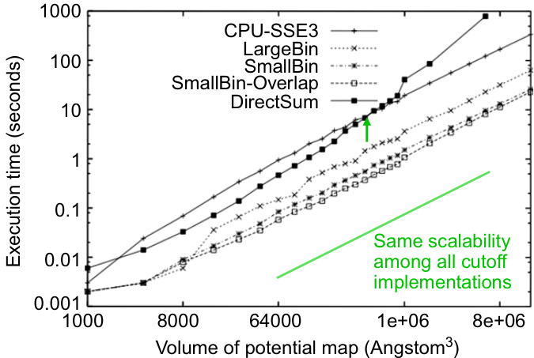
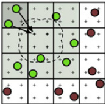
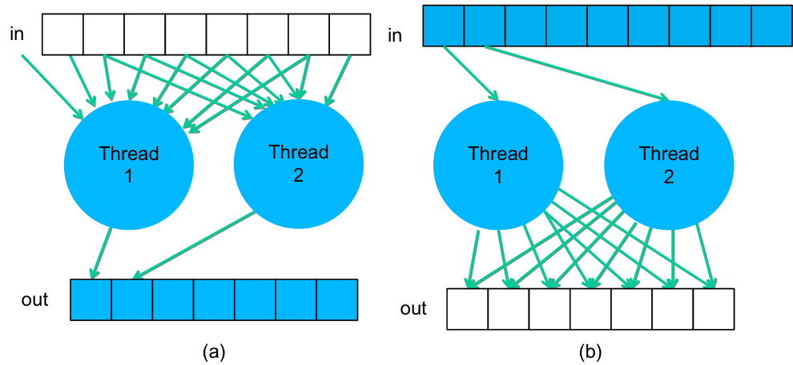
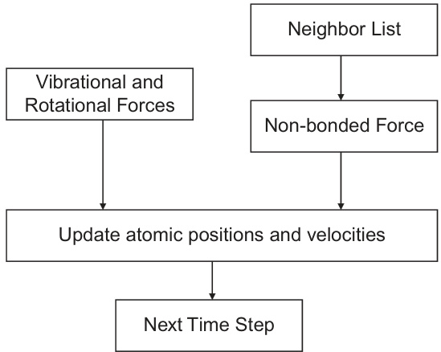
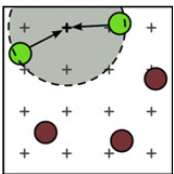

The image illustrates the 'gather' memory access pattern in a grid-centric threading arrangement, as discussed in Section 13.2 and shown in Figure 13.1(a). In this pattern, each CUDA thread (representing a grid point) collects or gathers the effects of input atoms (green circles) to calculate the electrostatic potential at its specific grid point, enhancing memory access efficiency and enabling better use of CUDA's private registers.

The image, found on page 291 (Figure 13.4), presents a performance comparison of different electrostatic potential map algorithms, plotting execution time against potential map volume. The graph demonstrates the scalability and performance of various algorithms, including CPU-SSE3, LargeBin, SmallBin, SmallBin-Overlap, and DirectSum. It highlights that while DirectSum performs well for moderate volumes, binned cutoff algorithms (LargeBin, SmallBin, SmallBin-Overlap) exhibit better scalability for larger volumes, all cutoff implementations displaying a similar scalability.

The image, referenced as Figure 13.3(b) on page 288, illustrates the 'Cutoff Summation' method used in electrostatic potential calculation. It demonstrates how each grid point considers contributions only from atoms within a fixed radius, depicted by a circle, to reduce computational complexity; atoms outside this radius (maroon) are considered negligible, while those within (green) are used in calculations, showcasing the cutoff binning strategy for grid algorithms.

The image, labeled as Figure 13.1 on page 284 of the document, illustrates two different thread arrangements: (a) gather-based and (b) scatter-based. In (a), multiple input data points are gathered by each thread to produce a single output, representing a grid-centric approach. Conversely, in (b), each thread scatters the effect of a single input atom to multiple grid points, which is an atom-centric approach and less desirable in CUDA due to potential race conditions.

The image, labeled as Figure 13.2 on page 285 of the document, illustrates the major tasks within a molecular dynamics application, showcasing the computational steps involved in simulating the behavior of atoms in a system; the workflow starts with obtaining a neighbor list and calculating vibrational, rotational, and non-bonded forces for each atom, followed by an update of atomic positions and velocities, and concludes with advancing to the next time step, representing a single iteration in the simulation process.

The image illustrates the concept of cutoff binning as discussed in Section 13.3 of the document. It represents a scenario where only atoms within a specific radius (green circles) contribute to the energy value of a given grid point, while atoms outside the radius (maroon circles) have negligible contributions. This approach reduces computational complexity by limiting the interactions considered for each grid point in electrostatic potential calculations, and the arrows indicate the atom selection performed, illustrating a key optimization technique for parallel grid algorithms.
