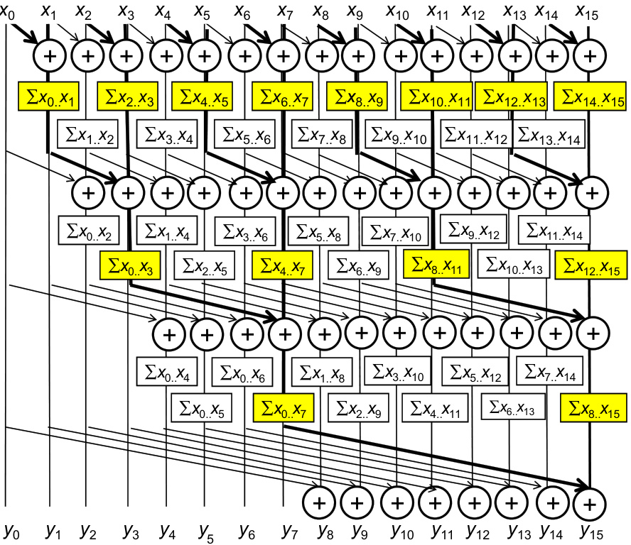
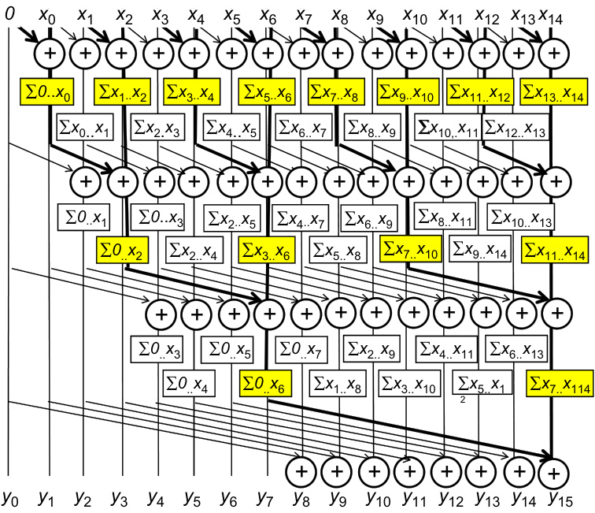
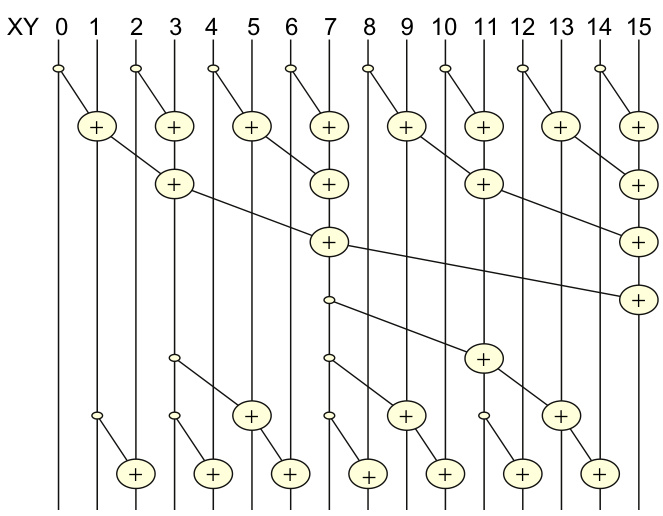
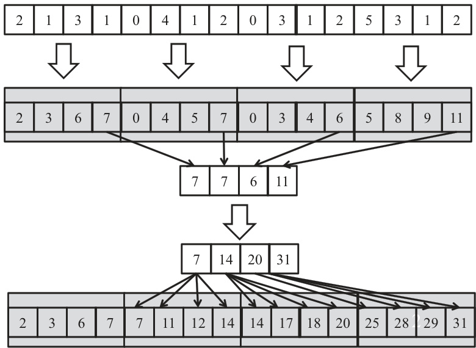
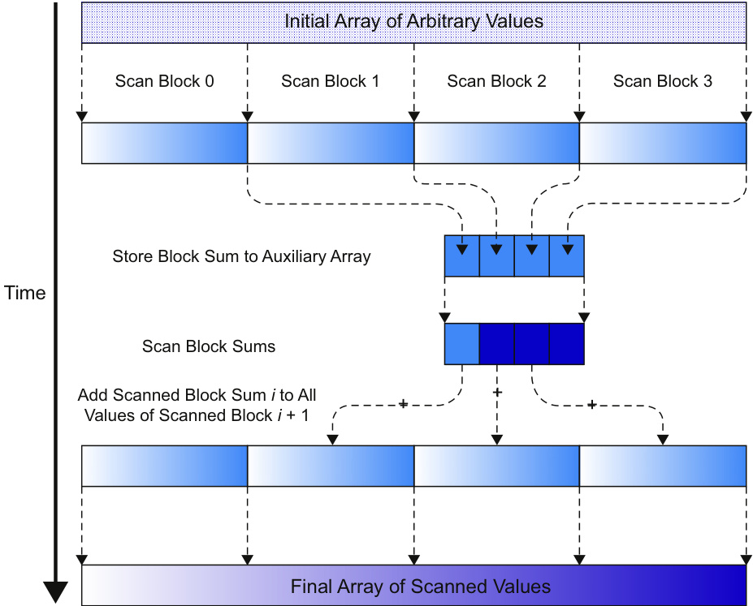
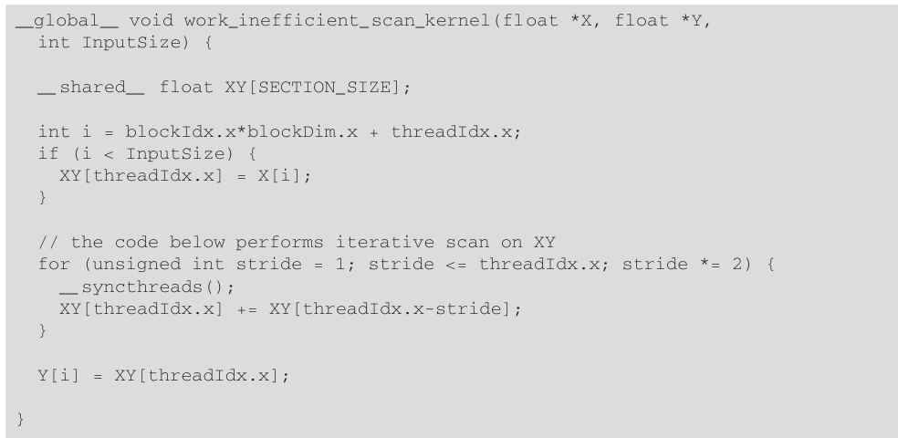

The image, labeled as Figure 9.1 on page 200 of the document, depicts a simple, yet work-inefficient, parallel inclusive scan algorithm. It visually represents the reduction tree for a 16-element input array, showing how the algorithm iteratively evolves to calculate prefix sums. Each vertical line represents an element, and addition operations are performed and labeled, with elements highlighted in yellow indicating the intermediate and final sums calculated during each iteration. This visualization aids in understanding the algorithm's parallel computation flow and its inherent inefficiency, as explained in the surrounding text.

The image, labeled as Figure 9.1 in Chapter 9, illustrates a simple but work-inefficient parallel inclusive scan algorithm as described on page 200. The algorithm operates in-place on an array XY and evolves iteratively to compute the prefix sum. The diagram visually demonstrates the reduction tree of addition operations required to calculate each output element, showcasing how each position receives the sum of its current content and that of its left neighbor in each iteration.

The image, found in Chapter 9 of the document, is Figure 9.4. It's a table comparing the number of add operations performed by a sequential scan algorithm (N-1) and a work-inefficient parallel scan algorithm (N*log₂(N) - (N-1)) for different input sizes N, ranging from 16 to 1024. This comparison aims to illustrate the work efficiency considerations of parallel scan algorithms, highlighting the increase in add operations for the work-inefficient algorithm as N grows.

The image depicts a simple parallel scan algorithm for inclusive prefix sum computation, as referenced in Figure 9.1 of the document. It illustrates a reduction tree structure where the 'XY' array elements are summed iteratively. The diagram shows how partial sums are computed and propagated across the array to generate the inclusive prefix sum.

The image illustrates an example of a hierarchical scan algorithm, as referenced in Figure 9.10 of the document. Initially, an array of 16 elements is divided into four scan blocks, and within each block, a scan operation is performed independently. The last element of each scan block is then extracted to form a new array that undergoes another scan operation. Finally, these second-level scan output values are added back to their respective scan blocks to obtain the final results for the entire array.

The image illustrates a hierarchical scan algorithm for arbitrary-length inputs, as described in Section 9.5. It depicts the process of partitioning an initial array into scan blocks, storing the sum of each block into an auxiliary array, performing a scan on these block sums, and then adding the scanned block sums to the values of the subsequent scan blocks to produce the final array of scanned values. The diagram visually represents the data flow and operations involved in this multi-level parallel scan approach, highlighting the use of block-level sums for efficient processing of large datasets.

The image, labeled as Figure 9.6 on page 10 of the document, displays partial sums available in each XY element after the reduction tree phase in a parallel scan algorithm. It shows the input array X0 through X15 and how intermediate sums are stored in the XY elements after the reduction tree, such as X0..X5 or X0..X11, which will be used for later calculations in the parallel scan. The chart visualizes the intermediate data states in the XY array which is crucial for understanding the reduction tree phase.

The image, found on page 205 of the document, is a table comparing the number of add operations for different input sizes (N) in a sequential scan algorithm and a work-inefficient parallel scan kernel, as discussed in Section 9.3 and visualized in Figure 9.2. The table presents the values of 'N-1' and 'N*log2(N) - (N-1)' and '2*N-3' for different values of N (16, 32, 64, 128, 256, 512, 1024), demonstrating the increased computational cost of the work-inefficient parallel scan relative to the sequential approach.

The image presents CUDA code for a work-inefficient parallel inclusive scan kernel, functioning as a baseline example in Section 9.2 of Chapter 9, focusing on prefix sum algorithms. It initializes a shared memory array `XY` and performs an iterative scan operation by repeatedly adding elements with increasing stride lengths, utilizing `syncthreads()` for synchronization. The inefficiency stems from each thread iterating through all reduction steps, irrespective of whether its `XY` position has already accumulated all necessary values, leading to redundant computations and control divergence, as explained in the text.
