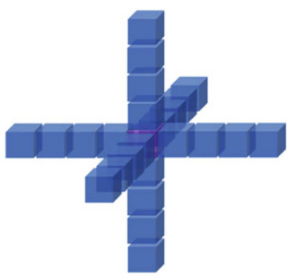
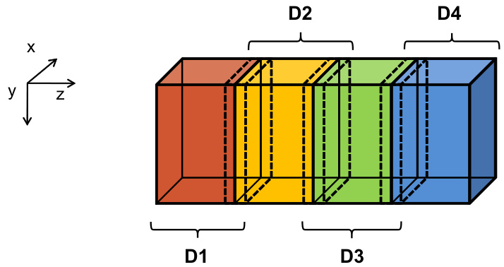
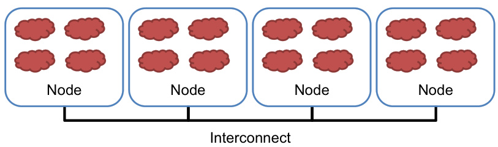
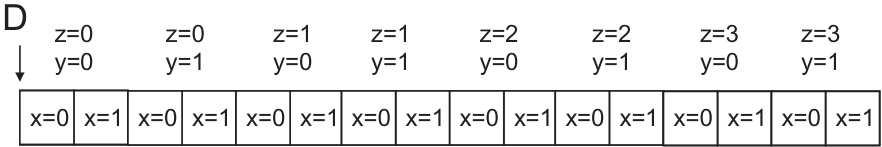
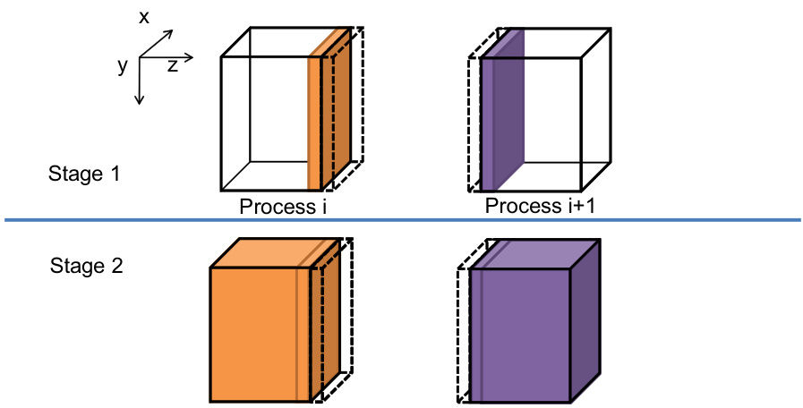

A imagem representa um exemplo de computação de stencil 25-stencil, conforme mencionado na página 409 do documento. Ela ilustra um ponto central e seus 24 vizinhos em um grid tridimensional, demonstrando como o valor de cada ponto é calculado com base nos valores dos seus vizinhos imediatos nas direções x, y e z. Este tipo de computação é usado como exemplo para explicar a implementação de algoritmos paralelos em clusters MPI.

A imagem ilustra a divisão de um array 3D em quatro partições de domínio (D1, D2, D3, D4) para computação paralela, conforme mencionado na página 410. Cada partição é atribuída a um processo de computação MPI. A disposição geométrica demonstra como um problema computacional é decomposto em subproblemas menores para serem processados em paralelo, destacando o eixo z como a dimensão de particionamento.

The image, labeled as Figure 19.1 on page 408 of the document, provides a programmer's perspective on MPI processes. It illustrates four nodes connected via an interconnect, with each node containing multiple processes, depicted as clouds. This setup highlights the distributed memory model inherent in MPI, where processes within different nodes communicate through message passing, a key concept in scaling heterogeneous applications across a cluster environment as discussed in Chapter 19.

The image, Figure 19.4 from page 411, illustrates a small example of memory layout for a 3D grid used in MPI programming. It depicts how data elements are organized in memory based on their x, y, and z coordinates, emphasizing the concept that elements with the lowest dimensions (y=0 and z=0) are placed in consecutive memory locations, followed by others based on y and z values; this shows how data is arranged before being processed.

The image illustrates a two-stage strategy for overlapping computation with communication in MPI. It shows two processes, 'Process i' and 'Process i+1', at two stages. In Stage 1, processes are computing boundary slices needed as halo cells by neighbors; in Stage 2, processes communicate boundary values and compute the rest of the partition. This is visualized as solid and transparent dashed pieces representing computed and halo data, respectively. The image is referenced in section 19.5, Overlapping Computation and Communication, specifically in relation to Figure 19.12 on page 422.
