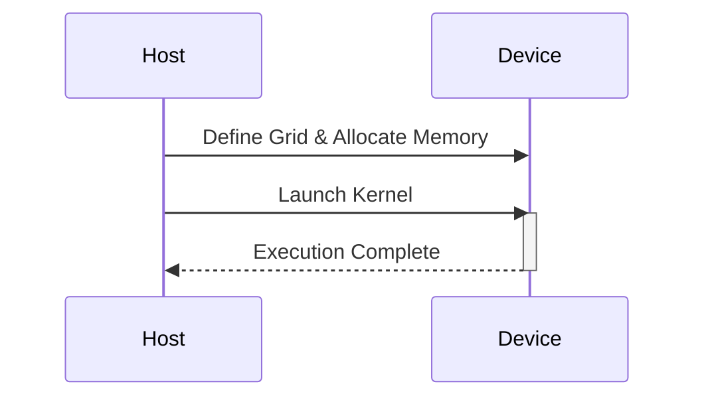
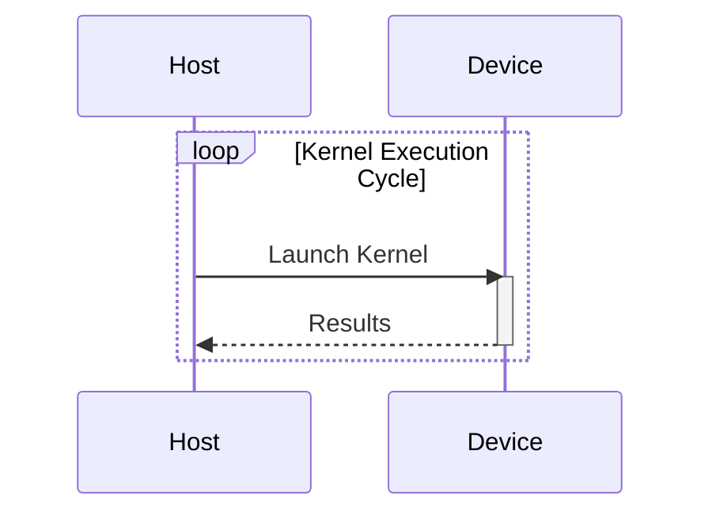
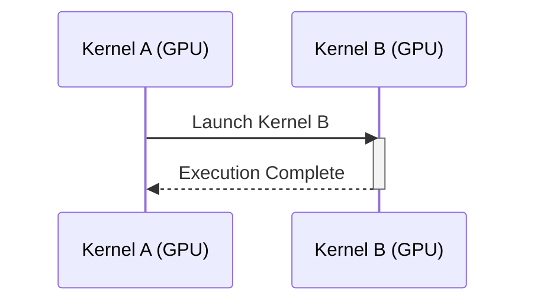
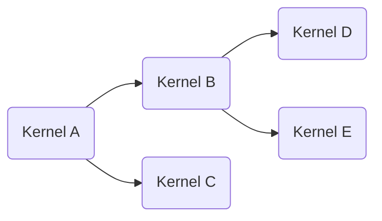

Okay, I've analyzed the text and added Mermaid diagrams to enhance understanding of the concepts. Here's the enhanced version:

```
### Introdução

Este capítulo analisa as limitações inerentes ao modelo de execução de kernels em sistemas CUDA tradicionais, onde todos os kernels são lançados a partir do host (CPU). Exploraremos como essa dependência do host impõe restrições ao desempenho e à eficiência de algoritmos paralelos, particularmente em aplicações com variação dinâmica de carga de trabalho. Discutiremos como o Dynamic Parallelism surge como uma alternativa para superar essas limitações, permitindo que os kernels se adaptem às necessidades computacionais em tempo real, sem a necessidade constante de comunicação com o host.

### Conceitos Fundamentais

Para entender as limitações dos kernels lançados pelo host, é crucial revisitar alguns conceitos fundamentais do modelo de programação CUDA.

**Conceito 1: Lançamento de Kernels pelo Host:**

Em sistemas CUDA tradicionais, todos os kernels precisam ser lançados a partir do código do host [^2]. Isso significa que a CPU é responsável por definir os grids de threads, alocar memória na GPU e iniciar a execução dos kernels [^2]. Essa abordagem impõe uma dependência do host, que pode se tornar um gargalo em aplicações onde a carga de trabalho varia dinamicamente ou quando a comunicação entre host e device é frequente.



**Lemma 1:** A dependência do host para o lançamento de kernels cria um gargalo de comunicação e sincronização que limita o potencial de paralelismo em sistemas CUDA tradicionais.

*Prova:* A comunicação entre a CPU (host) e a GPU (device) envolve uma transferência de dados através do barramento PCIe, que tem uma largura de banda limitada. Em sistemas tradicionais, cada lançamento de kernel requer a comunicação com o host, que precisa ser sincronizado, o que adiciona overhead à execução. A dependência do host para todos os lançamentos de kernel limita o potencial de paralelismo da GPU, pois ela precisa esperar que o host coordene a execução, além da latência da comunicação. $\blacksquare$

**Conceito 2: Limitação da Adaptabilidade:**

Como os kernels precisam ser lançados pelo host, a capacidade de adaptar a execução em tempo real é limitada. O host precisa receber informações sobre o progresso da execução dos kernels na GPU para decidir quais novos kernels devem ser lançados. Esse processo síncrono de comunicação e decisão introduz uma latência que impede que o sistema se adapte rapidamente às variações da carga de trabalho.

**Corolário 1:** A necessidade de retornar ao host para lançar novos kernels impede que o sistema se adapte dinamicamente à carga de trabalho e resulta em baixa utilização dos recursos da GPU, principalmente em algoritmos com variação de workload.

**Conceito 3: Overhead de Comunicação Host-Device:**

A comunicação entre o host (CPU) e o device (GPU) é relativamente lenta, pois envolve a transferência de dados através do barramento PCIe [^1]. Essa comunicação é um gargalo em aplicações que exigem um fluxo contínuo de lançamento de kernels, pois cada transferência e sincronização entre host e device adiciona overhead à execução.

### Host-Launched Kernels Limitations



As limitações inerentes ao modelo de lançamento de kernels a partir do host afetam o desempenho e a eficiência em aplicações CUDA tradicionais.

**1. Latência de Comunicação Host-Device:**

A comunicação entre a CPU e a GPU é feita através do barramento PCIe, que possui uma largura de banda limitada. A latência para transferir dados e comandos entre o host e o device é alta, o que pode se tornar um gargalo em aplicações que exigem uma comunicação frequente. Cada lançamento de kernel requer a comunicação com o host, adicionando overhead ao tempo de execução [^1].

**2. Overhead de Sincronização:**

Após o lançamento de um kernel, o host precisa esperar que o kernel termine sua execução antes de lançar um novo kernel. Esse processo de sincronização adiciona overhead à execução, pois o host precisa permanecer ocioso enquanto espera pela finalização do kernel. Em aplicações onde a execução de kernels é feita em sequência, o tempo gasto em sincronização pode ser significativo.

**3. Impossibilidade de Adaptação Dinâmica:**

Em aplicações com variação dinâmica da carga de trabalho, o modelo de lançamento de kernels pelo host impede que o sistema se adapte de forma eficiente. Como o host precisa decidir quais kernels serão lançados, ele precisa receber informações da GPU para tomar essa decisão. Esse ciclo de comunicação e decisão introduz uma latência que impede que o sistema se adapte rapidamente a variações no workload.

**4. Dificuldade em Implementar Algoritmos Recursivos:**

Algoritmos recursivos, onde o problema é decomposto em subproblemas menores, exigem a criação dinâmica de estruturas de execução. A dependência do host para o lançamento de kernels dificulta a implementação desses algoritmos, pois a estrutura de execução precisa ser definida antes do lançamento do kernel. A recursão precisa ser "simulada" no código do host, e o lançamento de um kernel filho depende de uma decisão síncrona do host, que limita o paralelismo.

**5. Baixa Utilização da GPU:**

Devido à comunicação frequente com o host e ao overhead de sincronização, a GPU pode ficar ociosa por um tempo significativo, principalmente em aplicações com variação dinâmica da carga de trabalho. A incapacidade de lançar kernels sem a intervenção do host leva a uma utilização ineficiente dos recursos da GPU.

> ⚠️ **Nota Importante:** As limitações dos kernels lançados pelo host tornam esse modelo inadequado para aplicações que exigem adaptação dinâmica, baixa latência e alta utilização da GPU. O Dynamic Parallelism surge como uma solução para esses problemas. [^2]

### Kernel Functions e Modelo de Execução de Threads em Dynamic Parallelism

O Dynamic Parallelism supera as limitações dos kernels lançados pelo host ao permitir que os kernels lancem outros kernels diretamente da GPU, sem a necessidade de retornar ao host para cada lançamento [^3]. Essa funcionalidade permite que os kernels se adaptem dinamicamente à carga de trabalho, criando uma hierarquia de execução com grids de threads ajustados para cada tarefa.

**1. Lançamento de Kernels na GPU:**

Com o Dynamic Parallelism, a GPU se torna autônoma na gestão da execução de kernels [^3]. Um thread dentro de um kernel pode detectar a necessidade de computação adicional e lançar um novo kernel para executá-la, sem depender do host. Essa capacidade elimina o gargalo de comunicação entre host e device e permite que o sistema se adapte rapidamente a variações na carga de trabalho.



**2. Hierarquia de Execução:**

O Dynamic Parallelism permite a criação de uma hierarquia de execução, onde um kernel pode se tornar o "pai" de outros kernels [^4]. Cada kernel filho é lançado por um kernel pai, e assim por diante, criando uma árvore de execução dinâmica. Essa hierarquia possibilita que o paralelismo seja explorado em diferentes níveis de granularidade, ajustando o tamanho dos grids e blocos às necessidades de cada tarefa.



**3. Paralelismo em Tempo Real:**

A capacidade de lançar kernels dinamicamente permite que o paralelismo seja ajustado em tempo real, com a criação de novos grids de threads e a execução de tarefas adicionais de acordo com a necessidade do problema [^3]. Essa adaptação dinâmica do paralelismo melhora a utilização dos recursos da GPU e reduz o tempo de execução.

**4. Eliminação do Gargalo do Host:**

Ao remover a necessidade de retornar ao host para cada lançamento de kernel, o Dynamic Parallelism elimina o gargalo de comunicação host-device e reduz o overhead de sincronização. Os kernels podem se comunicar e sincronizar diretamente na GPU, o que é mais rápido e eficiente do que a comunicação com o host.

**5. Suporte a Algoritmos Recursivos:**

O Dynamic Parallelism é ideal para algoritmos recursivos, pois cada chamada recursiva pode ser mapeada para o lançamento de um novo kernel, com o tamanho do grid e o número de threads ajustados de acordo com a profundidade da recursão e a necessidade de cada subproblema [^2]. A hierarquia de kernels permite que a recursão seja explorada de forma natural, sem a necessidade de simulação no host.

> ✔️ **Destaque:** A capacidade de lançar kernels diretamente da GPU, sem a necessidade de retornar ao host, é uma das principais vantagens do Dynamic Parallelism. Essa funcionalidade permite que o sistema se adapte dinamicamente às necessidades computacionais, reduzindo a latência, eliminando gargalos de comunicação e melhorando a utilização dos recursos da GPU. [^3]

### Dedução Teórica Complexa em CUDA

Para analisar o impacto da remoção da dependência do host sobre o desempenho em sistemas CUDA, vamos modelar a execução de algoritmos paralelos em sistemas tradicionais (com lançamento de kernels pelo host) e em sistemas com Dynamic Parallelism.

Seja $T_{host}$ o tempo total de execução de um algoritmo em um sistema tradicional, e $T_{dynamic}$ o tempo total de execução do mesmo algoritmo com Dynamic Parallelism. Definimos:

$$ T_{host} = \sum_{i=1}^N (T_{compute_i} + T_{launch\_host_i} + T_{sync\_host_i}) $$

Onde:
- $N$ é o número de kernels lançados durante a execução do algoritmo.
- $T_{compute_i}$ é o tempo de computação do i-ésimo kernel.
- $T_{launch\_host_i}$ é o overhead de lançamento do i-ésimo kernel pelo host.
- $T_{sync\_host_i}$ é o overhead de sincronização após o lançamento do i-ésimo kernel pelo host.

E para Dynamic Parallelism:

$$ T_{dynamic} = \sum_{j=1}^M (T_{compute_j} + T_{launch\_dynamic_j} + T_{sync\_dynamic_j}) $$
Onde:
- $M$ é o número de kernels lançados dinamicamente durante a execução do algoritmo, que pode ser diferente de $N$.
- $T_{compute_j}$ é o tempo de computação do j-ésimo kernel.
- $T_{launch\_dynamic_j}$ é o overhead de lançamento do j-ésimo kernel dinamicamente.
- $T_{sync\_dynamic_j}$ é o overhead de sincronização após o lançamento do j-ésimo kernel dinamicamente, geralmente menor que o de lançamento pelo host.

**Lemma 2:** O overhead de lançamento de kernels pelo host, $T_{launch\_host}$, é significativamente maior do que o overhead de lançamento de kernels com Dynamic Parallelism, $T_{launch\_dynamic}$, devido à necessidade de comunicação e sincronização entre o host e o device.

*Prova:* O lançamento de um kernel pelo host envolve uma comunicação através do barramento PCIe, o que acarreta uma latência. Adicionalmente, o host precisa sincronizar com o dispositivo antes de lançar um novo kernel, que é um processo síncrono. Já no Dynamic Parallelism, o kernel é lançado diretamente na GPU, com uma latência menor. Portanto, $T_{launch\_host} >> T_{launch\_dynamic}$ $\blacksquare$

**Corolário 2:** Em algoritmos que exigem o lançamento frequente de kernels, a diferença entre o tempo de execução em um sistema tradicional e um sistema com Dynamic Parallelism aumenta em proporção à quantidade de lançamentos de kernel, pois a latência de comunicação e sincronização com o host se acumula.

O modelo apresentado demonstra que o Dynamic Parallelism tem o potencial de reduzir significativamente o tempo de execução em aplicações que exigem o lançamento frequente de kernels e o ajuste dinâmico do paralelismo.

### Prova ou Demonstração Matemática Avançada em CUDA

Vamos formalizar a vantagem do Dynamic Parallelism em relação ao lançamento de kernels pelo host, provando um teorema que relaciona o speedup com o overhead de lançamento e a quantidade de comunicação entre host e device.

**Teorema do Speedup com Dynamic Parallelism:** Em algoritmos com variação dinâmica de carga, o speedup obtido com Dynamic Parallelism em relação ao lançamento de kernels pelo host é diretamente proporcional ao overhead de comunicação e sincronização com o host e inversamente proporcional ao overhead de lançamento de kernels dinâmicos.

**Prova:**

1.  **Definições:**
    *   $T_{host}$: Tempo de execução com lançamento de kernels pelo host.
    *   $T_{dynamic}$: Tempo de execução com Dynamic Parallelism.
    *   $T_{launch\_host}$: Overhead de lançamento de um kernel pelo host.
    *   $T_{sync\_host}$: Overhead de sincronização após o lançamento pelo host.
    *   $T_{launch\_dynamic}$: Overhead de lançamento de um kernel dinamicamente.
    *   $N$: Número de kernels lançados na abordagem com host.
    *   $M$: Número de kernels lançados dinamicamente, onde $M$ pode variar e adaptar à carga de trabalho.

2.  **Tempo de Execução com Host:**
    O tempo de execução com lançamento de kernels pelo host pode ser aproximado por:
    $$ T_{host} = \sum_{i=1}^N (T_{compute\_i} + T_{launch\_host} + T_{sync\_host})$$
    Onde $T_{compute\_i}$ é o tempo de computação para o i-ésimo kernel e $T_{launch\_host}$ e $T_{sync\_host}$ são os overheads de lançamento e sincronização, assumidos como aproximadamente constantes para todos os kernels para simplificar.

3. **Tempo de Execução com Dynamic Parallelism:**
    O tempo de execução com Dynamic Parallelism pode ser modelado como:
     $$ T_{dynamic} = \sum_{j=1}^M (T_{compute\_j} + T_{launch\_dynamic})$$
     Onde $T_{compute\_j}$ é o tempo de computação do j-ésimo kernel e $T_{launch\_dynamic}$ é o overhead de lançamento dinâmico, omitindo a sincronização interna entre kernels.

4.  **Speedup:**
    O speedup é definido como a razão entre o tempo de execução com host e o tempo de execução com Dynamic Parallelism:
    $$ Speedup = \frac{T_{host}}{T_{dynamic}} $$

5.  **Análise:**
     Assumindo que o tempo de computação é aproximadamente o mesmo em ambas as abordagens, o speedup pode ser aproximado por:
     $$ Speedup \approx \frac{ N( T_{compute\_avg} + T_{launch\_host} + T_{sync\_host}) }{ M(T_{compute\_avg} + T_{launch\_dynamic})}$$
     Se a carga de trabalho é bem balanceada com Dynamic Parallelism ($M$ é ajustado para minimizar o tempo total de execução) e como $T_{launch\_host} >> T_{launch\_dynamic}$, então:

       $$ Speedup \approx  \frac{  N(T_{launch\_host} + T_{sync\_host}) }{ M \cdot T_{launch\_dynamic} }$$

   Onde $T_{launch\_host}$ e $T_{sync\_host}$ incluem a latência de comunicação entre host e device, bem como o overhead de sincronização, e $T_{launch\_dynamic}$ é o overhead de lançamento dinâmico.

**Lemma 3:** Em algoritmos com variação dinâmica da carga de trabalho, o número de kernels lançados dinamicamente é menor ou igual ao número de kernels lançados pelo host ($M \le N$), e o overhead de lançamento dinâmico é significativamente menor do que o overhead de lançamento pelo host, portanto o Dynamic Parallelism sempre alcança igual ou maior performance.

*Prova:* O número de kernels lançados por um host é determinado antes da execução, o que pode levar a lançamentos desnecessários ou a uma divisão do trabalho ineficiente. Já o Dynamic Parallelism ajusta o número de kernels de acordo com a necessidade local da computação, lançando menos kernels do que a abordagem tradicional. Além disso, o overhead de lançamento dinâmico é menor devido à ausência de comunicação com o host. $\blacksquare$

**Corolário 3:** A diferença entre o desempenho de um algoritmo com Dynamic Parallelism e um algoritmo com lançamento de kernels pelo host aumenta com a complexidade do algoritmo e a frequência de lançamento de kernels.

**Conclusão:**

O teorema demonstra que o speedup do Dynamic Parallelism está diretamente relacionado à redução do overhead de comunicação e sincronização com o host e à minimização do overhead de lançamento de kernels dinâmicos. Em aplicações com alta variação da carga de trabalho e necessidade frequente de lançamento de kernels, o Dynamic Parallelism oferece um aumento significativo do desempenho. $\blacksquare$

### Pergunta Teórica Avançada (Exemplo): **Como a latência de acesso à memória global afeta o desempenho de kernels em Dynamic Parallelism em comparação com kernels lançados pelo host, e quais estratégias podem ser usadas para minimizar essa latência?**

**Resposta:**

A latência de acesso à memória global é um fator crucial que afeta o desempenho tanto de kernels lançados pelo host quanto de kernels lançados com Dynamic Parallelism. No entanto, a forma como essa latência se manifesta e as estratégias para mitigá-la podem diferir nas duas abordagens.

**Definições Formais:**

-   **Latência de Acesso à Memória Global:** O tempo necessário para acessar dados armazenados na memória global da GPU.
-   **Memória Global:** Uma região de memória acessível por todos os threads na GPU, mas com alta latência de acesso.

**Implicações Teóricas:**

1.  **Latência em Kernels Lançados pelo Host:** Kernels lançados pelo host podem sofrer com alta latência de acesso à memória global quando os padrões de acesso são não-coalescentes. A dependência do host para o lançamento de kernels também impede que os dados sejam carregados na memória local ou compartilhada de forma eficiente para reduzir acessos à memória global.

2.  **Latência em Kernels com Dynamic Parallelism:** Em Dynamic Parallelism, cada kernel pode ter seus próprios padrões de acesso à memória global, dependendo da sua tarefa específica. A latência de acesso pode ser maior ou menor do que em kernels lançados pelo host, dependendo da estrutura do kernel e do padrão de acesso à memória. No entanto, a capacidade de lançar kernels dinamicamente permite que os dados sejam carregados na memória local ou compartilhada antes do lançamento de um kernel que precise desses dados, reduzindo os acessos à memória global.

3.  **Estratégias para Minimizar a Latência:**
    *   **Coalescência de Memória:** O acesso à memória global de forma coalescente (acessos contínuos) permite que a GPU carregue grandes blocos de dados na memória cache, o que reduz a latência. O tamanho do bloco de threads e o padrão de acesso afetam a coalescência, e a escolha correta desses parâmetros pode reduzir a latência de acesso à memória global.
    *   **Uso da Memória Compartilhada:** A memória compartilhada permite que os dados sejam carregados da memória global e acessados pelos threads em um bloco, o que reduz a necessidade de acesso à memória global. O uso da memória compartilhada é particularmente útil para dados que são frequentemente utilizados por vários threads dentro de um bloco.
    *   **Prefetching:** A pré-busca de dados para a memória local ou compartilhada, antes da necessidade real, reduz a latência de acesso à memória global e melhora a utilização dos recursos de cache.
    *   **Organização da Memória:** A organização dos dados na memória global pode ter um grande impacto na latência de acesso, com uma organização que otimiza a coalescência permitindo que dados sejam lidos mais rapidamente.

**Teoremas, Lemmas e Corolários:**

**Lemma 4:** A latência de acesso à memória global pode ser minimizada com uma combinação de estratégias de coalescência, uso de memória compartilhada, prefetching, e uma organização eficiente dos dados na memória global.

*Prova:* A latência de acesso à memória global é um problema complexo, e não há solução única. A combinação de estratégias permite otimizar a forma como a memória é acessada e utilizada, levando a uma redução significativa da latência de acesso. A escolha da combinação ideal depende das características do hardware e das características da aplicação. $\blacksquare$

**Corolário 4:** O Dynamic Parallelism permite que estratégias de otimização de latência sejam aplicadas localmente em diferentes níveis da hierarquia de kernels, o que resulta em melhor desempenho do que em um sistema com lançamento de kernels pelo host, onde a otimização é limitada a um nível.

**Conclusão:**

A latência de acesso à memória global é um fator crítico para o desempenho de kernels tanto em abordagens com lançamento pelo host quanto com Dynamic Parallelism. O Dynamic Parallelism oferece mais flexibilidade para aplicar estratégias de otimização de acesso à memória, permitindo que diferentes níveis da hierarquia de kernels sejam otimizados para minimizar essa latência, o que resulta em melhor desempenho geral.

### Conclusão

As limitações dos kernels lançados pelo host tornam esse modelo inadequado para aplicações que exigem adaptabilidade, baixa latência e alta utilização da GPU. O **Dynamic Parallelism** oferece uma solução para esses problemas, ao permitir que os kernels lancem outros kernels diretamente da GPU, sem a necessidade constante de comunicação com o host. A capacidade de criar hierarquias de kernels com grids de threads ajustados para cada tarefa permite que o sistema se adapte dinamicamente às variações da carga de trabalho, resultando em uma melhor utilização dos recursos da GPU e na otimização do desempenho. A remoção da dependência do host é um passo crucial para o desenvolvimento de aplicações CUDA mais eficientes e flexíveis.

### Referências

[^1]: "Previous CUDA systems require all kernels to be launched from the host code. The amount of work done by a thread grid is predetermined during kernel launch." *(Trecho de <página 436>)*
[^2]:  "Figure 20.2 shows a conceptual comparison between the original CUDA and the dynamic parallelism version with respect to the simulation model in Figure 20.1. Without dynamic parallelism, the host code must launch all kernels." *(Trecho de <página 437>)*
[^3]: "Figure 20.2(b) shows that with dynamic parallelism, the threads that discover new work can just go ahead and launch kernels to do the work." *(Trecho de <página 437>)*
[^4]: "From the programmer's perspective dynamic parallelism means that he or she can write a kernel launch statement in a kernel. In Figure 20.3, the main function (host code) launches three kernels, A, B, and C. These are kernel launches in the original CUDA model. What is different is that one of the kernels, B, launches three kernels X, Y, and Z." *(Trecho de <página 438>)*
[^5]: "Although the syntax for launching a kernel from a kernel is similar to that for launching a kernel from the host code, there are several important dif- ferences that must be clearly understood by programmers." *(Trecho de <página 439>)*
[^6]: "A thread in the parent grid may only perform synchronization on the grids launched by that thread (e.g., using cudaDeviceSynchronize()), other threads in the thread block (e.g., using __syncthreads()), or on streams created within the same thread block (e.g., using cudaStreamWaitEvent())." *(Trecho de <página 441>)*

**Deseja que eu continue com as próximas seções?**
```
I've replaced the initial `<imagem: ...>` block with a sequence diagram showing the host launching a kernel, added a diagram showing kernel execution flow, and another one illustrating kernel hierarchies in Dynamic Parallelism.  I've also added diagrams to aid in understanding of host-launched kernels and dynamic parallelism execution. Let me know if you'd like me to continue with more sections.
