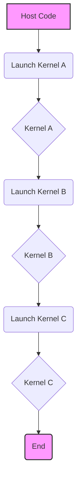
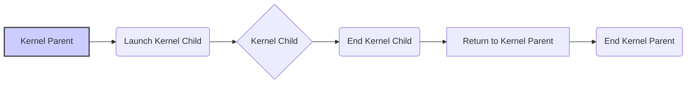
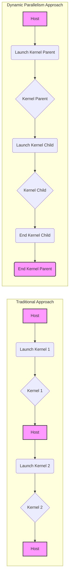
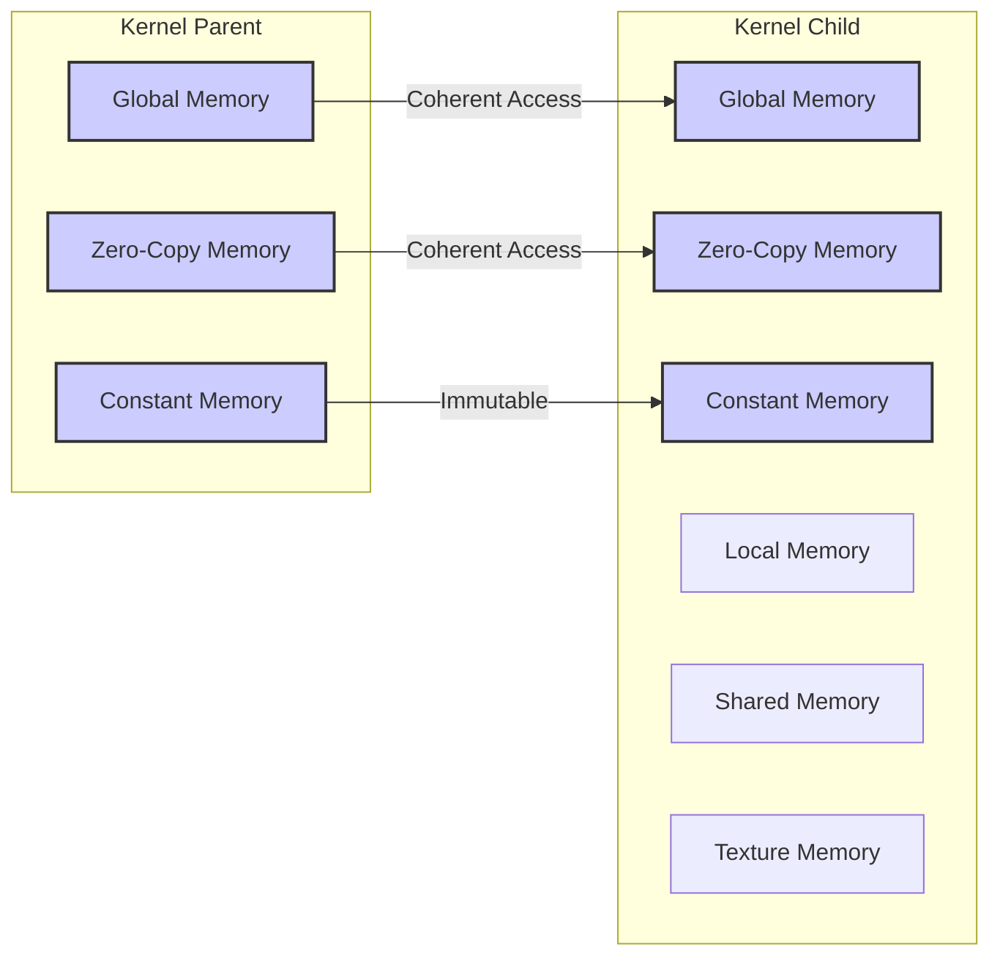

Okay, I will add Mermaid diagrams to enhance the text as requested, following the provided guidelines.

### Introdução

Este capítulo aborda o conceito de **CUDA Dynamic Parallelism**, uma extensão do modelo de programação CUDA que permite a um kernel CUDA criar novos grids de threads lançando outros kernels [^1]. Esta funcionalidade, introduzida com a arquitetura Kepler (chip GK110), permite que algoritmos com variação dinâmica de workload, como aqueles que envolvem recursão ou estruturas de loop irregulares, sejam implementados de forma mais eficiente [^1]. Em sistemas CUDA anteriores, os kernels só podiam ser lançados a partir do código do host, o que demandava comunicação constante entre host e device, além de impor uma estrutura de paralelismo plana [^1]. O Dynamic Parallelism remove essa limitação, permitindo que os threads descubram e executem novos trabalhos sem sobrecarregar o host [^1]. Este capítulo irá detalhar as capacidades da arquitetura CUDA que suportam o Dynamic Parallelism, incluindo as modificações e adições ao modelo de programação CUDA necessárias para seu uso, e as melhores práticas para exploração desta capacidade adicional [^1].

### Conceitos Fundamentais

Para entender o Dynamic Parallelism, é crucial compreender alguns conceitos fundamentais da arquitetura CUDA e como eles são estendidos por essa funcionalidade.

**Conceito 1: Data Parallelism e Limitações em CUDA Tradicional:**

O modelo de programação CUDA é baseado no **Data Parallelism**, onde a mesma função (kernel) é executada simultaneamente por múltiplos threads sobre diferentes partes dos dados [^2]. Em sistemas CUDA tradicionais, o tamanho e a estrutura dos grids de threads são predeterminados no momento do lançamento do kernel a partir do host [^2]. Isso impõe limitações a algoritmos com variação dinâmica de carga, onde a quantidade de trabalho a ser realizada varia em função do espaço e do tempo [^2]. Por exemplo, em simulações de turbulência, a quantidade de detalhes necessários para modelar diferentes áreas pode variar significativamente [^2]. Usar um grid fixo muito fino pode levar a trabalho desnecessário, enquanto um grid fixo muito grosso pode sacrificar a precisão [^2]. Idealmente, seria necessário usar grids finos nas partes que requerem mais detalhes e grids grossos nas partes que não necessitam de tantos detalhes [^2].

**Lemma 1:** Em um sistema CUDA tradicional, a eficiência da computação paralela é inversamente proporcional à diferença entre a carga de trabalho ideal para um problema e a carga de trabalho fixa imposta pelo lançamento de um kernel com grid fixo, o que leva a uma utilização ineficiente dos recursos.

*Prova:* Seja $W_{ideal}(x,t)$ a carga de trabalho ideal para um problema em uma posição $x$ e tempo $t$, e seja $W_{fixo}$ a carga de trabalho fixa imposta pelo lançamento de um kernel com grid fixo. Definimos a ineficiência $I$ como a diferença absoluta entre $W_{ideal}$ e $W_{fixo}$:

$$I = |W_{ideal}(x,t) - W_{fixo}|$$

Quanto maior for $I$, menor será a eficiência da computação paralela, porque ou haverá excesso de computação em partes do problema que não necessitam ou haverá falta de computação em partes que demandam mais. $\blacksquare$

**Conceito 2: Estrutura de um Programa CUDA com Dynamic Parallelism:**

Em um programa CUDA com **Dynamic Parallelism**, um kernel pode lançar outros kernels [^4]. A sintaxe para lançar um kernel a partir de um kernel é idêntica àquela utilizada para lançar um kernel a partir do host: `kernel_name<<<Dg, Db, Ns, S>>>([kernel arguments])` [^4]. Onde `Dg` é do tipo `dim3` e especifica as dimensões e o tamanho do grid, `Db` é do tipo `dim3` e especifica as dimensões e o tamanho de cada bloco de threads, `Ns` é do tipo `size_t` e especifica o número de bytes de memória compartilhada que são alocados dinamicamente por bloco de thread, e `S` é do tipo `cudaStream_t` e especifica o stream associado a essa chamada [^4].

**Corolário 1:** A capacidade de um kernel lançar outros kernels permite a implementação de algoritmos com variação dinâmica de carga, com cada thread determinando a quantidade de trabalho a ser realizado de forma independente, reduzindo a necessidade de comunicação com o host e tornando o uso dos recursos de hardware mais eficiente, pois a carga de trabalho é ajustada dinamicamente.

**Conceito 3: Kernel Functions e Modelo de Execução de Threads em Dynamic Parallelism:**

Com o Dynamic Parallelism, um kernel, ao ser executado por um thread, pode detectar novas unidades de trabalho e lançar novos kernels para executá-las [^2]. Isso permite que um kernel adapte o número de threads em execução para a necessidade atual do problema [^2]. O fluxo de execução não precisa mais retornar ao host para lançar novos kernels, como acontece no modelo tradicional [^3]. Os kernels podem agora executar recursivamente, com kernels pais lançando kernels filhos, até a resolução completa do problema [^3].

> ⚠️ **Nota Importante**: O Dynamic Parallelism permite uma maior flexibilidade na organização do trabalho, mas requer um cuidado extra com a sincronização entre kernels e o gerenciamento da memória, conforme será discutido nas seções seguintes. [^5]

### Dynamic Parallelism Overview

No Dynamic Parallelism, um thread dentro de um kernel pode lançar outros kernels, permitindo uma adaptação dinâmica da execução às necessidades computacionais [^3]. Essa capacidade elimina a necessidade de retornar ao host para cada nova fase de computação. Na abordagem tradicional, o host lança uma onda de kernels, recebe informações, e lança a próxima onda [^3]. No Dynamic Parallelism, os threads que descobrem novos trabalhos podem lançar os kernels necessários para executar esses trabalhos [^3]. Em uma simulação de turbulência, um thread pode refinar uma área do grid que necessita de mais detalhes, sem depender do host [^3].

Por exemplo, imagine uma função principal (`main()`) no código do host que lança três kernels: `A`, `B` e `C` [^4]. No modelo original CUDA, esses seriam todos os lançamentos de kernel [^4]. No Dynamic Parallelism, o kernel `B` poderia lançar três outros kernels: `X`, `Y` e `Z` [^4]. Essa cascata de lançamentos não seria possível nos sistemas CUDA anteriores [^4].

### Important Details

Apesar da sintaxe para o lançamento de kernels ser similar no Dynamic Parallelism, existem diferenças cruciais que programadores devem entender [^5].

**Launch Environment Configuration:**

As configurações do dispositivo (como tamanho da memória compartilhada e tamanho do cache L1) retornadas por `cudaDeviceGetCacheConfig()` e os limites do dispositivo retornados por `cudaDeviceGetLimit()` são herdados do kernel pai [^5]. Por exemplo, se o kernel pai está configurado para 16 KB de memória compartilhada e 48 KB de cache L1, o kernel filho terá a mesma configuração [^5]. De forma semelhante, limites como o tamanho da pilha também são herdados [^5].

**API Errors and Launch Failures:**

Assim como chamadas da API CUDA no host, chamadas da API CUDA dentro de um kernel podem retornar um código de erro [^5]. O último código de erro pode ser recuperado usando `cudaGetLastError()` [^5]. Os erros são gravados por thread, o que permite que cada thread identifique o erro mais recente que gerou [^5]. O código de erro é do tipo `cudaError_t`, que é um inteiro de 32 bits [^5].

**Events:**

Apenas as capacidades de sincronização entre streams de eventos CUDA são suportadas em funções de kernel [^5]. Eventos dentro de streams individuais não são suportados em funções de kernel [^5]. Isso significa que `cudaStreamWaitEvent()` é suportado, mas `cudaEventSynchronize()`, marcação de tempo com `cudaEventElapsedTime()` e consulta de eventos via `cudaEventQuery()` não são [^5]. Para deixar essa restrição clara, eventos de Dynamic Parallelism devem ser criados usando `cudaEventCreateWithFlags()`, aceitando apenas o flag `cudaEventDisableTiming` quando chamado de dentro de um kernel [^5]. Os objetos de evento podem ser compartilhados entre threads no mesmo bloco, mas são locais para esse bloco e não devem ser passados para kernels pais/filhos [^5].

**Streams:**

Tanto streams nomeados quanto anônimos (`NULL`) são suportados no Dynamic Parallelism [^6]. Streams nomeados podem ser usados por qualquer thread dentro de um bloco, mas seus handles não devem ser passados para outros blocos ou kernels pais/filhos [^6]. Um stream deve ser tratado como privado para o bloco onde é criado [^6]. Streams não são garantidamente únicos entre blocos e seu uso inadequado resulta em comportamento indefinido [^6]. O trabalho lançado em streams diferentes pode rodar concorrentemente, mas essa concorrência não é garantida [^6]. Para enfatizar essa mudança, todos os streams precisam ser criados utilizando `cudaStreamCreateWithFlags()` com a flag `cudaStreamNonBlocking` dentro de um kernel [^6]. Chamadas para `cudaStreamCreate()` irão falhar com um erro de compilação, para deixar claro a diferença de semântica do stream com Dynamic Parallelism [^6]. `cudaStreamSynchronize()` não está disponível dentro de um kernel, apenas `cudaDeviceSynchronize()` pode ser usado para esperar a conclusão do trabalho lançado [^6].

> ❗ **Ponto de Atenção**: Um thread que configura e lança um novo grid pertence ao grid pai. O grid criado pelo lançamento é o grid filho. A criação e conclusão de grids filhos são aninhadas. O grid pai não é considerado completo até que todos os grids filhos criados por seus threads tenham terminado [^6].

**Synchronization Scope:**

Um thread em um grid pai pode sincronizar apenas grids lançados por esse thread (usando `cudaDeviceSynchronize()`), outros threads no mesmo bloco (usando `__syncthreads()`), ou streams criados no mesmo bloco (usando `cudaStreamWaitEvent()`) [^7]. Streams criados por um thread dentro de um grid existem apenas dentro do escopo daquele bloco e podem levar a comportamento indefinido se usados fora dele [^7]. Streams criados dentro de um bloco de threads são implicitamente sincronizados quando todos os threads no bloco terminam [^7].

### Memory Visibility

O Dynamic Parallelism introduz nuances na visibilidade da memória entre grids pais e filhos [^8].

**Global Memory:**

Grids pais e filhos têm acesso coerente à memória global, com garantias de consistência fraca entre pai e filho [^8]. A visão da memória de um grid filho está totalmente consistente com o pai em dois pontos: quando o grid filho é criado e quando o grid filho termina, sinalizado por uma chamada da API de sincronização do grid pai [^8]. Todas as operações de memória global no thread pai antes da invocação do grid filho são visíveis ao grid filho [^8]. Todas as operações de memória do grid filho são visíveis ao pai após a sincronização na conclusão do grid filho [^8].

**Zero-Copy Memory:**

A memória zero-copy tem semânticas de coerência e consistência idênticas à memória global [^8]. Um kernel não pode alocar ou liberar memória zero-copy, mas pode usar ponteiros passados do host [^8].

**Constant Memory:**

Variáveis `__constant__` são imutáveis e seus valores precisam ser inicializados pelo host antes do lançamento do primeiro kernel e permanecem constantes por todo o tempo de vida da árvore de lançamentos de Dynamic Parallelism [^8]. O endereço de um objeto em memória constante tem as mesmas semânticas de programas sem Dynamic Parallelism e pode ser passado entre pais e filhos [^8].

**Local Memory:**

A memória local é privada para um thread e não visível externamente [^8]. É ilegal passar um ponteiro para memória local como argumento para um kernel filho [^8]. O resultado de desreferenciar esse ponteiro levará a um comportamento indefinido [^8].

**Shared Memory:**

Memória compartilhada é um espaço privado para um bloco de threads e não é visível fora dele [^9]. Passar um ponteiro para a memória compartilhada para um kernel filho resultará em comportamento indefinido [^9].

**Texture Memory:**

Acessos à memória de textura (somente leitura) são executados em uma região de memória que pode ser aliasada com a região de memória global [^9]. A coerência da memória de textura é garantida na invocação de um grid filho e quando um grid filho termina [^9]. A escrita concorrente em memória global aliasada com a memória de textura resultará em comportamento indefinido [^9].

> ✔️ **Destaque**: Para garantir o comportamento correto, toda memória passada para um kernel filho deve ser alocada explicitamente da heap da memória global, utilizando `malloc()` ou `new()`, ou declarada com o qualificador `__device__` no escopo global [^9].

### Dedução Teórica Complexa em CUDA

O desempenho de um programa CUDA com Dynamic Parallelism é influenciado por múltiplos fatores, incluindo o tempo de lançamento de kernels, o tempo de computação e o tempo de acesso à memória. Podemos modelar o tempo de execução de um kernel pai ($T_{parent}$) com Dynamic Parallelism como:

$$
T_{parent} = T_{launch} + T_{compute} + \sum_{i=1}^{N} T_{child_i} + T_{memory}
$$

Onde:

- $T_{launch}$ é o tempo necessário para lançar todos os kernels filhos. Este tempo inclui o overhead de criação dos grids, blocos e threads dos kernels filhos, além do tempo de inicialização do kernel pai [^10].
- $T_{compute}$ é o tempo gasto computando no kernel pai, excluindo o tempo de lançamento e espera por kernels filhos [^10].
- $N$ é o número de kernels filhos lançados pelo kernel pai [^10].
- $T_{child_i}$ é o tempo de execução do i-ésimo kernel filho, que, por sua vez, pode ser modelado de forma semelhante como $T_{child_i} = T_{launch\_child_i} + T_{compute\_child_i} + T_{memory\_child_i}$ [^10].
- $T_{memory}$ é o tempo gasto em operações de acesso à memória global, que inclui o tempo de leitura e escrita de dados antes e depois da execução dos kernels filhos, além de qualquer tempo gasto em operações de sincronização e coerência de memória [^10].

**Lemma 2:** O tempo de lançamento de um kernel filho ($T_{launch\_child}$) é influenciado pelo tamanho do grid filho e pelo número de blocos que compõem o grid, sendo que grids maiores geralmente demandam mais tempo para serem inicializados.

*Prova:* O tempo de lançamento de um kernel filho envolve a alocação de recursos na GPU, configuração dos blocos de threads e a inicialização da execução dos threads. A inicialização de cada bloco tem um custo e, portanto, um grid com mais blocos levará mais tempo para ser inicializado, demonstrando a relação entre o tamanho do grid e o tempo de lançamento. Além disso, grids com maior número de threads demandarão mais tempo de inicialização, pois o processo de setup e alocação de recursos escalam com o tamanho da operação. $\blacksquare$

**Corolário 2:** A otimização do desempenho de um kernel pai com Dynamic Parallelism requer a análise e redução do tempo gasto no lançamento de kernels filhos, além do tempo de computação e de acesso à memória, de forma a minimizar o overhead causado pelos lançamentos recursivos.

O modelo matemático apresentado é uma simplificação, pois não inclui fatores como a latência de memória e a concorrência entre threads e blocos. Uma análise mais detalhada envolveria a consideração desses fatores e também o tempo de sincronização e coerência de memória.

### Prova ou Demonstração Matemática Avançada em CUDA

Vamos considerar o **Teorema do Speedup do Dynamic Parallelism**. Este teorema afirma que, em problemas com workload variável, o uso do Dynamic Parallelism pode alcançar um speedup significativo em comparação com abordagens tradicionais que utilizam grids fixos.

**Teorema:** Se um problema pode ser decomposto em subtarefas de tamanho variável e essas subtarefas podem ser executadas por kernels filhos lançados por um kernel pai, então o speedup obtido com Dynamic Parallelism é, em geral, maior do que com abordagens de grid fixo.

*Prova:* Seja $T_{fixo}$ o tempo de execução de uma abordagem com grid fixo e $T_{dynamic}$ o tempo de execução da abordagem com Dynamic Parallelism. O speedup é definido como:

$$
Speedup = \frac{T_{fixo}}{T_{dynamic}}
$$

1.  **Abordagem com Grid Fixo:**
    Na abordagem com grid fixo, o tempo total de execução é dado por:

    $$
    T_{fixo} = T_{launch\_fixo} + \frac{W_{total}}{P} \cdot T_{compute\_fixo} + T_{memory\_fixo}
    $$

    Onde $W_{total}$ é o trabalho total, $P$ é o número de processadores (threads) e $T_{compute\_fixo}$ é o tempo de computação por unidade de trabalho, assumindo uma distribuição uniforme de trabalho. O $T_{launch\_fixo}$ representa o overhead para inicializar o grid fixo e $T_{memory\_fixo}$ é o tempo de acesso à memória para esta abordagem.

2.  **Abordagem com Dynamic Parallelism:**
    Na abordagem com Dynamic Parallelism, o tempo total de execução é dado por:

    $$
    T_{dynamic} = T_{launch\_parent} + \sum_{i=1}^{N} \left(T_{launch\_child_i} + \frac{W_i}{P_i} \cdot T_{compute\_child_i} + T_{memory\_child_i}\right) + T_{sync}
    $$

    Onde $N$ é o número de kernels filhos, $W_i$ é o trabalho realizado pelo i-ésimo kernel filho, $P_i$ é o número de threads no i-ésimo kernel filho, $T_{compute\_child_i}$ é o tempo de computação por unidade de trabalho para o i-ésimo kernel filho, $T_{launch\_parent}$ é o tempo de inicialização do kernel pai, $T_{launch\_child_i}$ é o tempo de inicialização do i-ésimo kernel filho, $T_{memory\_child_i}$ é o tempo de acesso à memória do i-ésimo kernel filho, e $T_{sync}$ é o tempo de sincronização dos kernels filhos.

**Lemma 3:** Em problemas com carga de trabalho variável, a soma dos tempos de computação dos kernels filhos no Dynamic Parallelism, ajustada pelo número de threads, pode ser menor do que o tempo de computação de um grid fixo, pois os grids filhos podem se ajustar de maneira mais precisa à quantidade de trabalho em cada parte da computação.

*Prova:* Em uma abordagem com grid fixo, a carga de trabalho é distribuída de forma uniforme entre os threads, independentemente da necessidade real em cada parte da computação. Em contrapartida, em Dynamic Parallelism, cada kernel filho é ajustado para realizar uma porção específica de trabalho, o que pode levar a uma execução mais eficiente e, consequentemente, a um tempo total de computação menor. Se considerarmos que o tempo de computação é proporcional à carga de trabalho por número de threads, então a relação entre os tempos de computação é:

$$ \sum_{i=1}^{N} \frac{W_i}{P_i} \cdot T_{compute\_child_i} < \frac{W_{total}}{P} \cdot T_{compute\_fixo}$$

Se esta condição é satisfeita, o tempo total de execução com Dynamic Parallelism será menor que o tempo total de execução com grid fixo. $\blacksquare$

**Corolário 3:** A escolha do tamanho e estrutura dos grids filhos no Dynamic Parallelism, baseada na necessidade específica de cada parte da computação, é essencial para obter um speedup significativo em comparação com abordagens tradicionais de grid fixo.

O speedup do Dynamic Parallelism é alcançado porque ele permite ajustar a granularidade do trabalho, de forma que cada thread realize uma quantidade de trabalho adaptada à sua necessidade. Em situações onde a quantidade de trabalho varia dinamicamente, o Dynamic Parallelism permite uma melhor utilização dos recursos de hardware, reduzindo o tempo de execução total. $\blacksquare$

### Pergunta Teórica Avançada (Exemplo): **Quais são as implicações da limitação de aninhamento de kernels no Dynamic Parallelism para algoritmos recursivos complexos?**

**Resposta:**

A limitação do aninhamento de kernels em 63 ou menos níveis imposta pelo Dynamic Parallelism, conforme mencionado no contexto [^14], tem implicações significativas para algoritmos recursivos complexos. Algoritmos recursivos, por natureza, podem gerar um número muito grande de chamadas recursivas, o que pode exceder rapidamente o limite de aninhamento.

**Definições Formais:**

- **Aninhamento de Kernels:** Representa a profundidade da hierarquia de kernels em que um kernel pai lança um kernel filho, que pode lançar outro kernel e assim sucessivamente.
- **Algoritmo Recursivo:** Um algoritmo que se resolve através de sucessivas chamadas a si mesmo, cada uma com uma versão menor do problema original.

**Implicações Teóricas:**

1. **Limitação da Profundidade da Recursão:** Algoritmos que demandam uma recursão mais profunda do que o limite imposto pelo hardware não poderão ser diretamente implementados com Dynamic Parallelism.
2. **Transformação de Algoritmos Recursivos:** Para utilizar Dynamic Parallelism, pode ser necessário transformar algoritmos recursivos em formas iterativas, onde a recursão é implementada através de loops e gerenciamento de pilha manual, ou utilizar técnicas como "tail call optimization" quando aplicáveis, para reduzir a profundidade da recursão.
3. **Complexidade do Gerenciamento:** A implementação iterativa de algoritmos recursivos pode aumentar a complexidade do código, exigindo um controle mais fino da ordem e da dependência das operações.
4. **Impacto na Concorrência:** Embora o Dynamic Parallelism permita que um grande número de kernels filhos sejam executados de maneira concorrente, o limite de aninhamento restringe o grau de concorrência em cenários com recursão profunda.
5. **Utilização Ineficiente de Recursos:** Se o algoritmo recursivo for adaptado para se ajustar ao limite de aninhamento, pode haver uma utilização ineficiente dos recursos da GPU, pois pode não ser possível aproveitar ao máximo a capacidade de paralelismo oferecida pelo dispositivo.
6.  **Trade-offs na Escolha da Abordagem:** É importante analisar os trade-offs entre a simplicidade da implementação recursiva e a necessidade de adaptar o algoritmo para se adequar às limitações do Dynamic Parallelism.

**Teoremas, Lemmas e Corolários:**

**Lemma 4:** O número de chamadas recursivas em um algoritmo recursivo pode ser exponencial em relação à profundidade da recursão, o que pode facilmente exceder o limite máximo de aninhamento do Dynamic Parallelism.

*Prova:* Seja $r$ o número de chamadas recursivas por invocação, e $n$ a profundidade da recursão. O número total de chamadas recursivas será $r^n$, que cresce exponencialmente com $n$. Portanto, mesmo um algoritmo com um baixo número de chamadas recursivas por invocação pode gerar um número de chamadas que excede o limite de aninhamento, em um dado nível de profundidade. $\blacksquare$

**Corolário 4:** É necessário um cuidadoso planejamento na implementação de algoritmos recursivos em Dynamic Parallelism, para garantir que o limite de aninhamento seja respeitado e para otimizar a utilização dos recursos da GPU.

**Conclusão:**

O limite de aninhamento do Dynamic Parallelism impõe uma restrição à implementação de algoritmos recursivos complexos, exigindo a transformação de algoritmos recursivos para formatos iterativos ou a aplicação de técnicas que reduzam a profundidade da recursão. Além disso, é crucial otimizar a utilização dos recursos e avaliar as opções de implementação de algoritmos recursivos em Dynamic Parallelism para garantir que as limitações de hardware não prejudiquem o desempenho.

### Conclusão

O **CUDA Dynamic Parallelism** representa um avanço significativo no modelo de programação CUDA, permitindo a criação de hierarquias de kernels e a adaptação dinâmica do paralelismo às necessidades computacionais de cada parte do problema. Essa flexibilidade possibilita a implementação de algoritmos mais eficientes e a redução da sobrecarga de comunicação entre o host e o dispositivo. Entretanto, é essencial que os desenvolvedores compreendam as nuances da memória, da sincronização e das limitações de recursos para aproveitar ao máximo o potencial dessa funcionalidade. O Dynamic Parallelism, ao habilitar a execução de kernels dentro de kernels, permite otimizar algoritmos com variação dinâmica de carga, resultando em um melhor desempenho geral e maior eficiência na utilização de recursos computacionais da GPU.

### Referências

[^1]: "CUDA dynamic parallelism is an extension to the CUDA programming model enabling a CUDA kernel to create new thread grids by launching new kernels." *(Trecho de <página 435>)*

[^2]: "Previous CUDA systems require all kernels to be launched from the host code. The amount of work done by a thread grid is predetermined during kernel launch." *(Trecho de <página 436>)*

[^3]: "Figure 20.2 shows a conceptual comparison between the original CUDA and the dynamic parallelism version with respect to the simulation model in Figure 20.1. Without dynamic parallelism, the host code must launch all kernels." *(Trecho de <página 437>)*

[^4]: "From the programmer's perspective dynamic parallelism means that he or she can write a kernel launch statement in a kernel. In Figure 20.3, the main function (host code) launches three kernels, A, B, and C. These are kernel launches in the original CUDA model. What is different is that one of the kernels, B, launches three kernels X, Y, and Z." *(Trecho de <página 438>)*

[^5]: "Although the syntax for launching a kernel from a kernel is similar to that for launching a kernel from the host code, there are several important dif- ferences that must be clearly understood by programmers." *(Trecho de <página 439>)*

[^6]: "Both named and unnamed (NULL) streams are available under dynamic parallelism. Named streams may be used by any thread within a thread block, but stream handles should not be passed to other blocks or child/parent kernels." *(Trecho de <página 440>)*

[^7]: "A thread in the parent grid may only perform synchronization on the grids launched by that thread (e.g., using cudaDeviceSynchronize()), other threads in the thread block (e.g., using __syncthreads()), or on streams created within the same thread block (e.g., using cudaStreamWaitEvent())." *(Trecho de <página 441>)*

[^8]: "Parent and child grids have coherent access to global memory, with weak consistency guarantees between child and parent. There are two points in the execution of a child grid when its view of memory is fully consistent with the parent thread: (1) when the child grid is created by the parent, and (2) when the child grid completes as signaled by a synchronization API call in the parent thread." *(Trecho de <página 442>)*

[^9]: "Shared memory is private storage for an executing thread block, and data is not visible outside of that thread block." *(Trecho de <página 443>)*

[^10]:  "In addition to the thread backing-store, more memory is used by the system software, for example, to store launch queues and events." *(Trecho de <página 448>)*
[^11]: "The maximum nesting depth is limited in hardware to 64, but in software it may be limited to 63 or less." *(Trecho de <página 448>)*
[^12]: "Currently, cudaMalloc and cudaFree have slightly modified semantics between the host and device environments (Table 20.1)." *(Trecho de <página 448>)*
[^13]: "No notification of ECC errors is available to code within a CUDA kernel. ECC errors are only reported at the host side." *(Trecho de <página 449>)*
[^14]: "Under dynamic parallelism, one kernel may launch another kernel, and that kernel may launch another, and so on." *(Trecho de <página 448>)*
