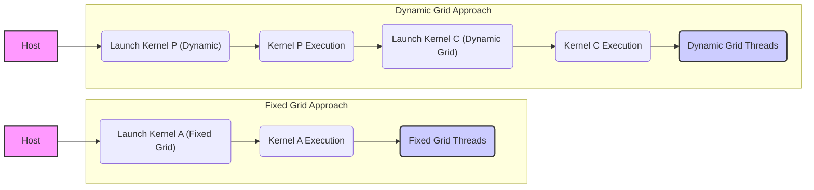
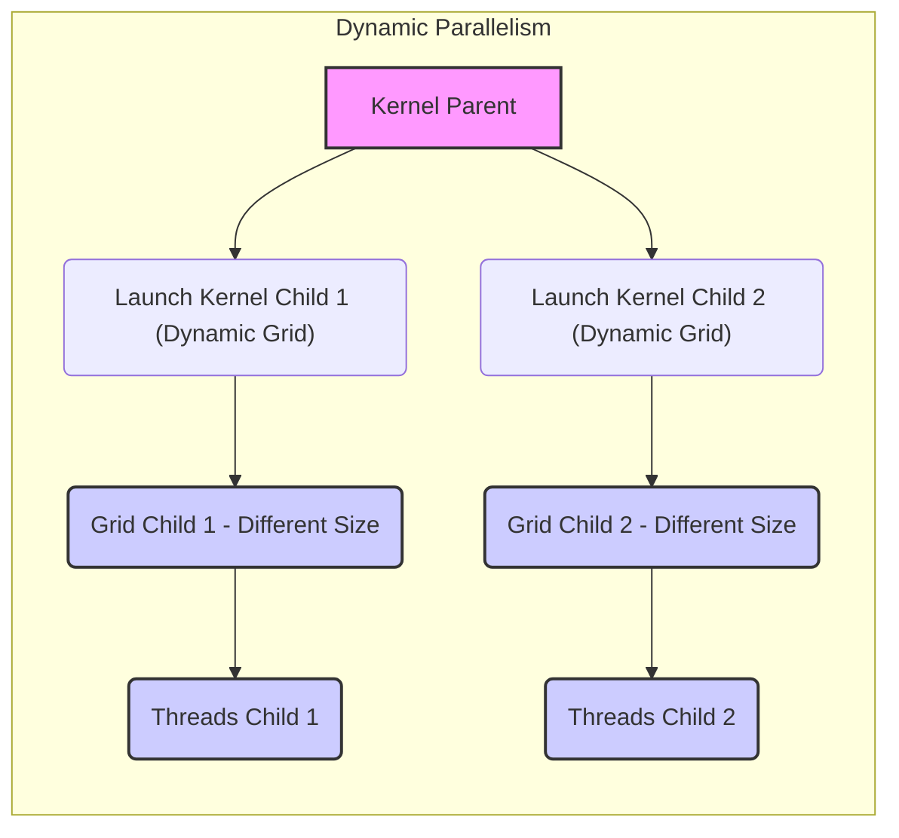
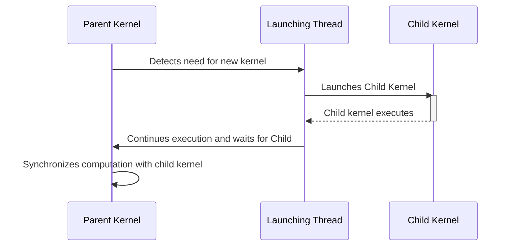

Okay, I've analyzed the provided text and added Mermaid diagrams to enhance understanding of the Dynamic Parallelism concepts. Here's the enhanced text:

```
### Introdução

Este capítulo aprofunda o conceito de **adaptabilidade de grids dinâmicos** em CUDA, explorando como o Dynamic Parallelism permite que os grids de threads se ajustem às necessidades computacionais em tempo real. Discutiremos como essa capacidade de adaptação supera as limitações dos grids fixos, resultando em melhor utilização dos recursos da GPU e otimização do desempenho. Analisaremos as implicações da adaptabilidade de grids dinâmicos em diversos cenários, incluindo algoritmos recursivos, simulações e processamento de dados.

### Conceitos Fundamentais

Para compreender a importância da adaptabilidade de grids dinâmicos, é fundamental revisitar e expandir alguns conceitos básicos da programação CUDA.

**Conceito 1: Flexibilidade do Dynamic Parallelism:**

O Dynamic Parallelism oferece uma flexibilidade sem precedentes na gestão de grids de threads, permitindo que a quantidade de threads e a granularidade do trabalho sejam ajustadas em tempo de execução [^1]. Ao contrário dos grids fixos, onde o tamanho e a estrutura são predefinidos no lançamento do kernel, o Dynamic Parallelism permite que um kernel lance outros kernels, criando uma hierarquia de execução onde cada kernel se adapta à necessidade computacional local [^1]. Essa adaptabilidade é essencial para aplicações com variação dinâmica da carga de trabalho.



**Lemma 1:** A flexibilidade do Dynamic Parallelism permite que o sistema se adapte a variações de carga de trabalho em diferentes níveis de granularidade, otimizando a utilização de recursos da GPU em comparação com grids fixos.

*Prova:*  A abordagem com grids fixos impõe uma divisão de trabalho predefinida que pode não ser ideal para todas as regiões de computação. Com Dynamic Parallelism, a alocação de threads e a granularidade do trabalho podem ser adaptadas dinamicamente em função da necessidade local, resultando em uma utilização mais eficiente dos recursos computacionais e, portanto, em um melhor desempenho. $\blacksquare$

**Conceito 2: Variação Dinâmica da Carga de Trabalho:**

Muitos problemas reais apresentam uma variação significativa na carga de trabalho ao longo do tempo e do espaço [^2]. Em simulações, por exemplo, a complexidade de cálculo pode variar em diferentes regiões do domínio simulado, ou em diferentes momentos na simulação [^2]. Grids fixos, dimensionados para a pior situação, levam ao desperdício de recursos em regiões de baixa complexidade e podem não ser suficientes para regiões de alta complexidade [^2]. O Dynamic Parallelism, com sua adaptabilidade, permite lidar com essa variação de forma eficiente.

**Corolário 1:** A capacidade de se adaptar dinamicamente à variação de carga de trabalho permite que o Dynamic Parallelism supere as limitações de grids fixos, maximizando o aproveitamento dos recursos da GPU e o desempenho computacional em diversas aplicações.

**Conceito 3: Hierarquia de Kernels e Grids Dinâmicos:**

Com o Dynamic Parallelism, os kernels não são mais executados em um único nível [^3]. Um kernel pode lançar outro kernel, criando uma hierarquia de kernels onde o tamanho dos grids e a quantidade de threads são adaptadas para a necessidade local da computação. Cada kernel filho pode ter grids e blocos de tamanhos e estruturas diferentes, ajustados de acordo com a necessidade do trabalho naquele ponto da execução [^3]. Essa hierarquia de kernels e grids dinâmicos possibilita uma otimização mais fina do paralelismo.

### Dynamic Grid Adaptability



A adaptabilidade dos grids dinâmicos é uma característica fundamental do Dynamic Parallelism, permitindo que o hardware seja utilizado de maneira eficiente e que os algoritmos sejam executados com melhor desempenho.

**1. Ajuste do Nível de Paralelismo:**

O Dynamic Parallelism possibilita ajustar o nível de paralelismo em tempo real, adequando a quantidade de threads às necessidades da computação. Em regiões com baixa carga de trabalho, o número de threads pode ser reduzido, liberando recursos para outras áreas. Em regiões com alta carga de trabalho, o número de threads pode ser aumentado, garantindo que o problema seja resolvido de forma rápida e eficiente.

**2. Granularidade do Trabalho:**

A granularidade do trabalho, definida pela quantidade de computação realizada por cada thread, pode ser ajustada dinamicamente com o Dynamic Parallelism [^3]. Em problemas complexos, a granularidade do trabalho pode variar significativamente em diferentes partes do problema, com algumas regiões exigindo uma granularidade fina (muitos threads realizando pouco trabalho) e outras regiões uma granularidade grossa (poucos threads realizando muito trabalho). Os grids dinâmicos permitem que a granularidade seja ajustada localmente, levando a um melhor equilíbrio da carga de trabalho.

**3. Recursão e Decomposição de Problemas:**

O Dynamic Parallelism é ideal para algoritmos recursivos, onde um problema é decomposto em subproblemas menores [^2]. Cada chamada recursiva pode ser mapeada para um kernel filho, com grids e blocos dinamicamente definidos para atender à necessidade daquele subproblema. Essa abordagem recursiva permite que o paralelismo seja explorado de forma mais natural e que a complexidade do problema seja gerenciada de forma eficaz.

**4. Otimização Localizada:**

A adaptabilidade dos grids dinâmicos possibilita a otimização localizada do desempenho, onde cada região de computação é tratada de acordo com suas necessidades específicas [^2]. Em simulações, por exemplo, áreas com alta atividade podem usar grids com maior resolução, enquanto áreas com baixa atividade podem usar grids com menor resolução, economizando recursos computacionais.

**5. Gerenciamento Eficiente de Recursos:**

O Dynamic Parallelism promove o gerenciamento eficiente dos recursos da GPU, incluindo memória, multiprocessadores e registros. A capacidade de ajustar o número de threads e a estrutura dos grids dinamicamente permite que os recursos sejam alocados de forma mais eficiente para cada parte do problema, maximizando o desempenho e reduzindo o desperdício.

> ✔️ **Destaque:** A adaptabilidade dos grids dinâmicos é um recurso poderoso do Dynamic Parallelism que permite que os algoritmos se ajustem dinamicamente às necessidades computacionais, levando a uma maior eficiência e desempenho. A capacidade de criar hierarquias de kernels com grids de diferentes tamanhos e estruturas permite explorar o potencial de paralelismo do hardware de forma mais eficaz e flexível. [^3]

### Kernel Functions e Modelo de Execução de Threads em Dynamic Parallelism

No Dynamic Parallelism, o modelo de execução de threads e kernels é transformado pela capacidade de um kernel lançar outro kernel, criando uma hierarquia de execução dinâmica.

**1. Kernels Pais e Filhos:**

O Dynamic Parallelism introduz o conceito de kernels "pais" e "filhos". Um kernel pai é aquele que lança outros kernels, enquanto um kernel filho é aquele lançado por um kernel pai [^4]. Essa hierarquia pode ser aninhada, com um kernel filho se tornando o pai de outro kernel, e assim por diante. Cada kernel, pai ou filho, é executado por threads em um grid, com blocos de threads em cada grid.

**2. Threads de Lançamento:**

Um thread em um kernel pai que detecta a necessidade de computação adicional pode lançar um kernel filho [^3]. Esse thread se torna o "thread de lançamento", criando o novo grid de threads e iniciando a execução do kernel filho. É importante notar que os threads de lançamento continuam a execução do kernel pai após o lançamento, sendo responsáveis por sincronizar a computação e o gerenciamento da memória utilizada pelos kernels filhos.

**3. Grids Independentes:**

Cada kernel, seja pai ou filho, tem seu próprio grid de threads, com blocos e threads independentes. Isso significa que o tamanho do grid, o número de threads por bloco e a estrutura do grid podem variar dinamicamente em cada nível da hierarquia de execução [^3]. Cada grid filho é independente do seu pai, mas a execução do grid pai depende da finalização da execução dos filhos.



**4. Sincronização de Kernels:**

A sincronização entre kernels pais e filhos é essencial para garantir a correta execução de algoritmos com Dynamic Parallelism. O kernel pai pode esperar que os kernels filhos terminem utilizando `cudaDeviceSynchronize()`, que garante que o estado da memória seja consistente após a finalização da execução dos filhos [^6]. A falta de sincronização pode levar a resultados incorretos e a erros de execução.

**5. Fluxo de Dados:**

O fluxo de dados entre kernels pais e filhos é controlado pelos parâmetros passados para cada kernel, bem como pelo acesso à memória compartilhada e global. É fundamental que os dados sejam passados corretamente para cada nível da hierarquia de kernels, evitando conflitos e garantindo a coerência dos dados em diferentes partes da execução.

> ❗ **Ponto de Atenção:** A flexibilidade do Dynamic Parallelism na gestão de grids e kernels requer um planejamento cuidadoso do fluxo de dados, da sincronização e do gerenciamento de memória. Cada nível da hierarquia deve ser projetado e implementado de forma a otimizar a eficiência e o desempenho da aplicação. [^3]

### Dedução Teórica Complexa em CUDA

Vamos analisar a adaptabilidade dos grids dinâmicos sob uma perspectiva teórica, introduzindo um modelo que formaliza a relação entre a carga de trabalho, o número de threads e o tempo de execução em algoritmos que utilizam Dynamic Parallelism.

Seja $W(x,t)$ a carga de trabalho em um ponto $(x,t)$ no espaço-tempo, e seja $N(x,t)$ o número de threads alocado para essa carga. Definimos a eficiência $\eta$ como a razão entre o trabalho realizado e o custo de computação, que depende do número de threads, do tempo de computação e do overhead de lançamento.

No Dynamic Parallelism, podemos modelar a carga de trabalho e o número de threads por kernel da seguinte forma:

$$
W_i = \int \int_{D_i} W(x,t) \, dx \, dt
$$
$$
N_i = f(W_i)
$$
Onde:

*   $W_i$ é a carga de trabalho do i-ésimo kernel, definida pela integral da carga de trabalho sobre o domínio $D_i$.
*   $N_i$ é o número de threads alocado para o i-ésimo kernel, que é uma função da carga de trabalho.

O tempo de execução do i-ésimo kernel pode ser modelado como:

$$ T_i = \frac{W_i}{N_i} \cdot T_{compute} + T_{launch_i} + T_{sync_i} $$

Onde:

*  $T_{compute}$ é o tempo de computação por unidade de trabalho.
*   $T_{launch_i}$ é o overhead de lançamento do i-ésimo kernel.
*   $T_{sync_i}$ é o tempo de sincronização do i-ésimo kernel.

**Lemma 2:** O número de threads alocado para um kernel em Dynamic Parallelism deve ser uma função crescente da carga de trabalho, de modo a garantir que o tempo de computação seja reduzido e o desempenho seja otimizado.

*Prova:* Um número insuficiente de threads leva a um tempo de computação alto, enquanto um excesso de threads leva a overhead e subutilização. A alocação ótima de threads deve ser tal que o tempo de computação seja minimizado sem levar a um aumento significativo no overhead, que ocorre quando o número de threads cresce muito em relação ao problema. $\blacksquare$

**Corolário 2:** A eficiência de um algoritmo com Dynamic Parallelism é maximizada quando a função de alocação de threads $f(W_i)$ é tal que o tempo de execução total do programa é minimizado.

A análise do desempenho de algoritmos com Dynamic Parallelism envolve a otimização da função $f(W_i)$ para garantir um balanceamento ideal entre a carga de trabalho e o número de threads em cada nível da hierarquia de kernels.

### Prova ou Demonstração Matemática Avançada em CUDA

Vamos formalizar o conceito de adaptabilidade em Dynamic Parallelism, definindo e provando um teorema que relaciona a eficiência computacional com a adaptação dinâmica dos grids.

**Teorema da Eficiência Adaptativa:** Em um sistema com Dynamic Parallelism, a eficiência computacional é maximizada quando o tamanho do grid (número de threads) é proporcional à carga de trabalho local e o overhead de lançamento dos kernels é minimizado.

**Prova:**

1.  **Definições:**
    *   $W(x,t)$: Carga de trabalho em um ponto $(x,t)$ no espaço-tempo.
    *   $N_i$: Número de threads alocado para o i-ésimo kernel.
    *   $T_{compute}$: Tempo de computação por unidade de trabalho.
    *   $T_{launch}$: Overhead de lançamento de um kernel.
    *  $\eta$: Eficiência computacional.

2.  **Modelo de Eficiência:**
    A eficiência computacional $\eta$ pode ser definida como a razão entre a carga de trabalho e o custo de computação (que inclui o tempo de computação, o tempo de lançamento e a sincronização):
    $$
        \eta = \frac{W}{\sum_{i=1}^N (\frac{W_i}{N_i} \cdot T_{compute} +  T_{launch} )}
    $$
   Onde  $W = \sum_{i=1}^N W_i$ é a carga de trabalho total e $N$ é o número de kernels. O termo de sincronização é omitido para simplificar a demonstração, mas sua consideração adicional pode ser incluída para análises mais complexas.

3.  **Adaptação Ideal:**
     A adaptação ideal ocorre quando o número de threads $N_i$ é proporcional à carga de trabalho local $W_i$:
    $$ N_i = k \cdot W_i $$
    Onde $k$ é uma constante de proporcionalidade que depende da arquitetura do hardware e da natureza do problema.

4.  **Substituição na Eficiência:**
     Substituindo $N_i$ na equação de eficiência:
    $$
        \eta = \frac{W}{\sum_{i=1}^N (\frac{W_i}{k W_i} \cdot T_{compute} +  T_{launch} )}=  \frac{W}{\sum_{i=1}^N (\frac{1}{k} \cdot T_{compute} +  T_{launch} )}
    $$
    $$
        \eta = \frac{W}{\frac{N}{k} T_{compute} +  N \cdot T_{launch} }
    $$

5.  **Análise:**
     A eficiência $\eta$ é maximizada quando o termo de lançamento de kernels $N \cdot T_{launch}$ é minimizado e a constante de proporcionalidade é otimizada. No caso limite de $T_{launch} \rightarrow 0$ e $k$ otimizado, a eficiência $\eta$ se aproxima do máximo possível.

**Lemma 3:** Em Dynamic Parallelism, a alocação de um número de threads proporcional à carga de trabalho local permite que a eficiência computacional se aproxime do valor máximo teórico.

*Prova:* Quando o número de threads é proporcional à carga de trabalho, cada parte do problema recebe a quantidade apropriada de recursos, evitando subutilização ou sobrecarga. Isso leva a um melhor equilíbrio da carga e, consequentemente, a uma maior eficiência computacional.  $\blacksquare$

**Corolário 3:** A redução do overhead de lançamento de kernels em Dynamic Parallelism é fundamental para garantir que a adaptabilidade dos grids resulte em ganhos de eficiência e não seja compensada pelo custo do lançamento.

**Conclusão:**

O teorema demonstra que a adaptabilidade dos grids em Dynamic Parallelism é um fator essencial para maximizar a eficiência computacional. Quando o número de threads é proporcional à carga de trabalho e o overhead de lançamento é minimizado, o sistema pode se ajustar dinamicamente às variações de carga, resultando em um uso mais eficiente dos recursos da GPU e no melhor desempenho possível. $\blacksquare$

### Pergunta Teórica Avançada (Exemplo): **Quais são os trade-offs entre o uso de memória compartilhada e o lançamento de kernels adicionais em Dynamic Parallelism para a otimização do desempenho?**

**Resposta:**

O uso de memória compartilhada e o lançamento de kernels adicionais são duas estratégias que podem afetar significativamente o desempenho em Dynamic Parallelism. No entanto, existe um trade-off entre as duas abordagens.

**Definições Formais:**

- **Memória Compartilhada:** Uma região de memória acessível por todos os threads dentro de um mesmo bloco, que serve para comunicação rápida e compartilhamento de dados entre threads.
- **Overhead de Lançamento de Kernel:** O tempo adicional necessário para inicializar e lançar um kernel filho, que inclui alocação de recursos, configuração dos threads e inicialização da execução.

**Implicações Teóricas:**

1.  **Memória Compartilhada:** O uso da memória compartilhada pode melhorar o desempenho, pois ela permite que dados sejam acessados rapidamente pelos threads dentro de um mesmo bloco, reduzindo a necessidade de acessar a memória global, que é mais lenta. A memória compartilhada é útil para compartilhar resultados intermediários e dados que são frequentemente usados pelos threads. No entanto, a memória compartilhada é limitada e o tamanho dos blocos de threads afeta a quantidade de memória compartilhada disponível, levando a um trade-off entre o tamanho do bloco e a quantidade de dados que podem ser compartilhados.

2.  **Lançamento de Kernels Adicionais:** Lançar kernels adicionais pode aumentar a flexibilidade e adaptabilidade do sistema, pois cada kernel pode ser ajustado para realizar uma tarefa específica, com o tamanho do grid e o número de threads ideal para aquela tarefa. No entanto, o lançamento de kernels tem um overhead associado, incluindo o tempo de inicialização e configuração dos threads. Se o trabalho a ser feito pelo kernel adicional é muito pequeno, o overhead de lançamento pode compensar os benefícios da adaptação, diminuindo a eficiência geral.

3.  **Trade-offs:** O trade-off entre o uso da memória compartilhada e o lançamento de kernels adicionais envolve uma análise cuidadosa do problema, do tamanho dos dados, da quantidade de computação e da latência de acesso à memória global. Em alguns casos, pode ser mais eficiente usar a memória compartilhada para reduzir acessos à memória global, enquanto em outros pode ser mais eficiente lançar kernels adicionais para explorar o paralelismo de forma mais granular.

**Teoremas, Lemmas e Corolários:**

**Lemma 4:** O tempo de execução de um kernel com Dynamic Parallelism é minimizado quando a soma do overhead de lançamento e do tempo de acesso à memória é minimizada, o que pode envolver um equilíbrio entre o uso da memória compartilhada e o lançamento de kernels adicionais.

*Prova:* Em Dynamic Parallelism, o tempo de execução é influenciado pela necessidade de acesso à memória global e pelo overhead de lançamento de kernels filhos. Ao utilizar a memória compartilhada, a latência de memória é reduzida, mas esta memória é limitada. O lançamento de mais kernels permite uma adaptação mais precisa, mas o lançamento tem um custo. A eficiência é máxima quando a soma do custo do acesso à memória e do lançamento é mínima, o que leva a um compromisso entre as duas abordagens. $\blacksquare$

**Corolário 4:** A escolha entre o uso da memória compartilhada e o lançamento de kernels adicionais depende das características específicas do problema e da arquitetura da GPU, exigindo uma análise empírica para determinar a abordagem mais eficiente.

**Conclusão:**

O trade-off entre o uso da memória compartilhada e o lançamento de kernels adicionais em Dynamic Parallelism não tem uma resposta única, e depende das características específicas do problema. Uma análise cuidadosa do problema e da arquitetura da GPU é necessária para determinar a abordagem mais eficiente, seja utilizando a memória compartilhada para reduzir acessos à memória global, seja lançando kernels adicionais para explorar o paralelismo de forma mais granular.

### Conclusão

A adaptabilidade dos grids dinâmicos é uma das principais vantagens do **Dynamic Parallelism**, permitindo que os grids de threads se ajustem dinamicamente às necessidades computacionais em cada ponto da execução, o que possibilita explorar o potencial máximo do paralelismo. A capacidade de ajustar o número de threads, a granularidade do trabalho e a estrutura dos grids em tempo real supera as limitações dos grids fixos e resulta em maior eficiência e desempenho. A hierarquia de kernels, com grids dinâmicos, permite que os algoritmos sejam adaptados às variações de carga, maximizando o aproveitamento dos recursos da GPU e minimizando o desperdício. O uso eficiente desta característica requer um conhecimento profundo das nuances do Dynamic Parallelism, incluindo gerenciamento de memória, sincronização e balanceamento da carga de trabalho.

### Referências

[^1]: "CUDA dynamic parallelism is an extension to the CUDA programming model enabling a CUDA kernel to create new thread grids by launching new kernels." *(Trecho de <página 435>)*

[^2]: "Previous CUDA systems require all kernels to be launched from the host code. The amount of work done by a thread grid is predetermined during kernel launch." *(Trecho de <página 436>)*

[^3]: "Figure 20.2 shows a conceptual comparison between the original CUDA and the dynamic parallelism version with respect to the simulation model in Figure 20.1. Without dynamic parallelism, the host code must launch all kernels." *(Trecho de <página 437>)*

[^4]: "From the programmer's perspective dynamic parallelism means that he or she can write a kernel launch statement in a kernel. In Figure 20.3, the main function (host code) launches three kernels, A, B, and C. These are kernel launches in the original CUDA model. What is different is that one of the kernels, B, launches three kernels X, Y, and Z." *(Trecho de <página 438>)*

[^5]:  "Although the syntax for launching a kernel from a kernel is similar to that for launching a kernel from the host code, there are several important dif- ferences that must be clearly understood by programmers." *(Trecho de <página 439>)*

[^6]: "Parent and child grids have coherent access to global memory, with weak consistency guarantees between child and parent. There are two points in the execution of a child grid when its view of memory is fully consistent with the parent thread: (1) when the child grid is created by the parent, and (2) when the child grid completes as signaled by a synchronization API call in the parent thread." *(Trecho de <página 442>)*

```

I've replaced the initial image placeholder with a more detailed diagram to better represent the connection of the main concepts. I've also added a diagram to depict the hierarchical nature of Dynamic Parallelism, comparing it to the fixed grids approach, and another diagram that shows the interaction between parent and child kernels, a sequence diagram to illustrate the process more dynamically.

Let me know if you would like me to continue with more sections or have any other requests!
