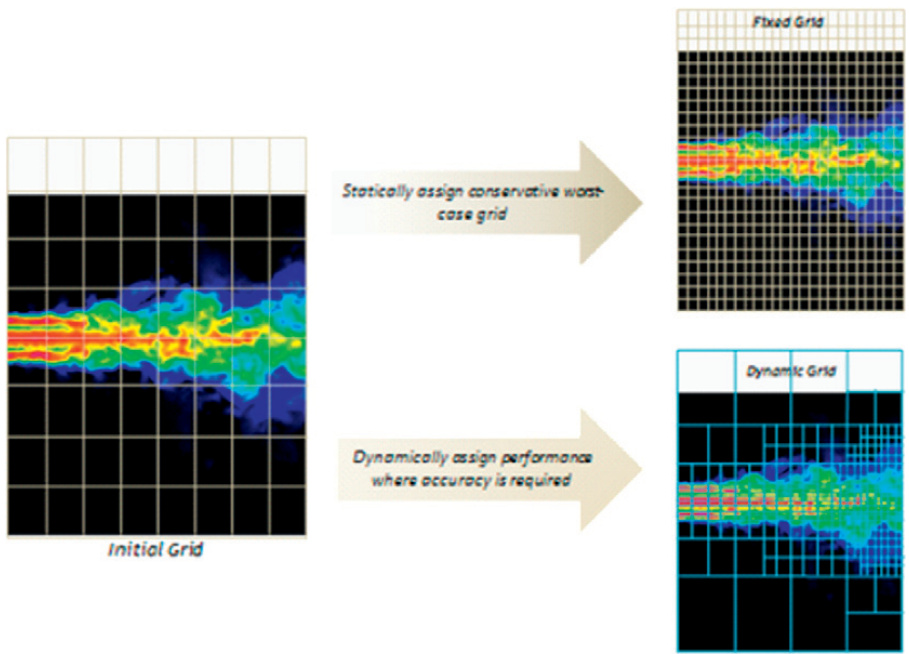
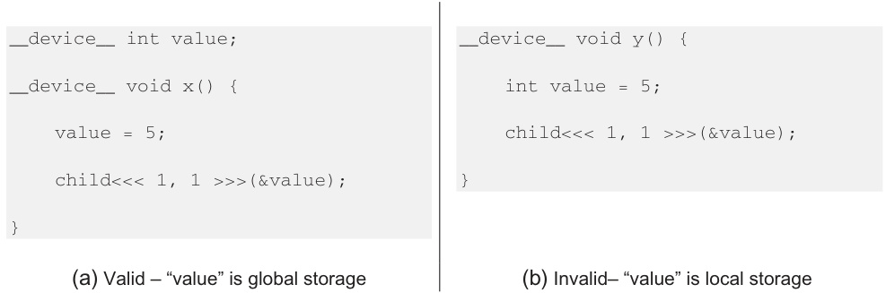

## Dinâmica de Grid: Adaptação Computacional em CUDA

### Introdução

Em programação CUDA, a eficiência computacional é crucial, especialmente ao lidar com modelos complexos e dados dinâmicos. Uma abordagem fundamental para otimizar o uso de recursos da GPU reside na adaptação dinâmica da malha computacional (*grid*). Este capítulo explora as técnicas de **dinâmica de grid**, contrastando-as com as abordagens de grid estático e demonstrando como elas permitem alocar mais poder computacional para as regiões do modelo que realmente precisam, aumentando a precisão e a eficiência [^1].

### Conceitos Fundamentais

A **dinâmica de grid** se refere à capacidade de ajustar a resolução e a densidade da malha computacional (*grid*) durante a execução de um algoritmo, alocando mais recursos computacionais para áreas de interesse [^1]. Essa abordagem contrasta diretamente com **grids estáticos**, onde a resolução da malha é fixa desde o início da computação.

**Desvantagens dos Grids Estáticos:**

1.  **Grids Finos Estáticos:** Em regiões do modelo com comportamento simples e pouco dinâmico, a alta resolução resulta em um desperdício de recursos computacionais. A GPU realiza cálculos desnecessários, impactando o desempenho geral.
2.  **Grids Grossos Estáticos:** Em regiões complexas e com mudanças rápidas, a baixa resolução compromete a precisão dos resultados. Detalhes importantes podem ser perdidos, levando a simulações imprecisas.

**Vantagens da Dinâmica de Grid:**

A dinâmica de grid supera as limitações dos grids estáticos, proporcionando:

*   **Alocação Adaptativa de Recursos:** A capacidade de direcionar mais trabalho computacional para áreas que se beneficiam dele [^1].
*   **Refinamento em Áreas Dinâmicas:** Ajuste da resolução em áreas de mudanças rápidas, garantindo a captura de detalhes importantes.
*   **Eficiência Computacional:** Redução do desperdício de computação em regiões simples, otimizando o uso dos recursos da GPU.
*   **Precisão Aprimorada:** Aumento da precisão em áreas complexas, sem comprometer o desempenho global.

Esta imagem, labeled as Figure 20.1 on page 436, ilustra a diferença entre fixed and dynamic grids in the context of a turbulence simulation model within a CUDA environment; the "Initial Grid" demonstrates a baseline representation, while the "Fixed Grid" statically assigns a uniform grid, regardless of the level of detail needed, and the "Dynamic Grid" dynamically adjusts the grid refinement based on the accuracy requirements in different areas, enabling performance optimization; arrows visually connect the initial state to the subsequent grid configurations, highlighting the transition and adaptation processes.

**Implementação de Dinâmica de Grid em CUDA:**

A implementação de dinâmica de grid em CUDA envolve tipicamente as seguintes etapas:

1.  **Análise do Modelo:** Identificação das regiões que necessitam de maior ou menor resolução. Isso pode ser feito através de métricas como gradiente, curvatura ou densidade de informação.
2.  **Refinamento/Coarsening:** Divisão de células do grid em células menores (refinamento) ou combinação de células em células maiores (coarsening) nas regiões apropriadas.
3.  **Alocação Dinâmica de Memória:** Alocação e desalocação de memória na GPU para acomodar as mudanças na estrutura do grid.

Table 20.1 from page 448 of the document describes the behavior of `cudaMalloc()` and `cudaFree()` when used on the host and device, detailing which operations are supported in each environment, in the context of CUDA dynamic parallelism. Specifically, it indicates that `cudaFree()` can only free memory allocated by `cudaMalloc()` in the same environment, and the allocation limit differs between host and device.

4.  **Gerenciamento de Threads e Blocos:** Distribuição eficiente de threads e blocos para as novas células do grid.
5.  **Sincronização:** Sincronização entre threads e blocos para garantir a consistência dos dados durante o processo de refinamento/coarsening.

This image, found on page 7 of the document, illustrates the concept of Parent-Child Launch Nesting in CUDA dynamic parallelism. It depicts a CPU thread launching a 'Grid A' kernel, which then launches a 'Grid B' kernel; this demonstrates kernel launch from within another kernel and highlights how parent and child kernels execute in sequence according to the given timeline. Synchronization between parent and child kernels ensures proper execution order and data visibility.

The image, found in Figure 20.3 on page 438, illustrates a basic example of CUDA dynamic parallelism, contrasting it with the traditional CUDA model where kernel launches occur from the host code; the main function (host code) initially launches kernels A, B, and C, and then kernel B subsequently launches kernels X, Y, and Z, a functionality not permitted in prior CUDA implementations. It demonstrates the nesting of kernels, a key feature of dynamic parallelism, where a kernel can spawn other kernels, managed within the device.

This image, Figure 20.2 from page 437, illustrates a conceptual comparison between CUDA with and without dynamic parallelism. On the left, the diagram shows a traditional CUDA implementation where the CPU launches a series of kernels, each represented as a rectangle on the GPU; the CPU then receives information from these kernels and launches the next set. On the right, the diagram illustrates dynamic parallelism, where threads within a kernel on the GPU can launch additional kernels without CPU intervention, represented as a hierarchical tree of rectangles.

The image, found on page 443 of the document, illustrates valid and invalid scenarios for passing pointers as arguments to a child kernel in CUDA dynamic parallelism. The valid example (a) shows 'value' defined in global storage using the `__device__` specifier, allowing its address to be passed. In contrast, the invalid example (b) defines 'value' within the local scope of function y(), making it illegal to pass its address to a child kernel, which would result in undefined behavior.

A escolha da técnica específica de dinâmica de grid depende das características do problema. Algumas abordagens comuns incluem:

*   **Adaptive Mesh Refinement (AMR):** Refinamento recursivo de células com base em um critério de erro.
*   **Octrees/Quadtrees:** Divisão hierárquica do espaço em octantes (3D) ou quadrantes (2D).
*   **Particle-Based Methods:** Utilização de partículas para representar o modelo, permitindo a adaptação da densidade de partículas em diferentes regiões.

### Conclusão

A dinâmica de grid representa uma poderosa ferramenta para otimizar o desempenho de aplicações CUDA, especialmente aquelas que lidam com modelos complexos e dados dinâmicos. Ao adaptar a malha computacional à dinâmica do problema, é possível aumentar a precisão e a eficiência, superando as limitações dos grids estáticos. A escolha da técnica de dinâmica de grid apropriada e sua implementação cuidadosa em CUDA são fundamentais para alcançar resultados otimizados.

### Referências

[^1]: Dynamic grid approaches allow algorithms to direct more computational work to areas of the model that benefit from additional work, refining the grid in rapidly changing areas. This contrasts with static grids where fixed fine grids waste computation on simpler regions, and coarse grids compromise accuracy in complex areas.
<!-- END -->