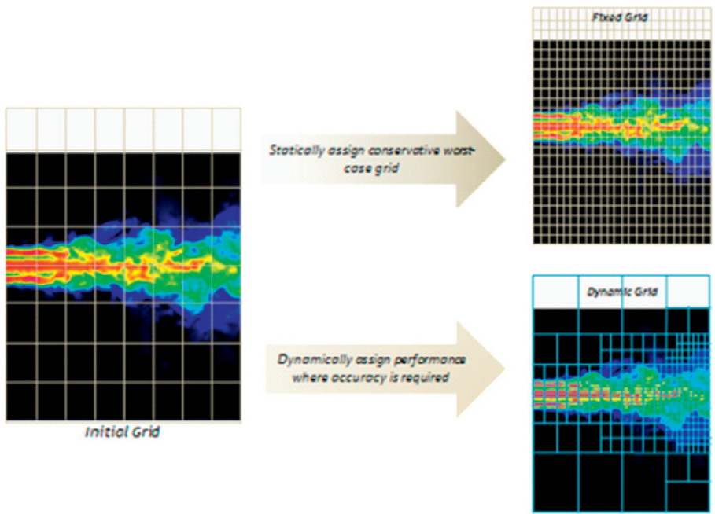

## Dynamic Parallelism: Kernel Launches from the Device

### Introdução

Este capítulo explora o conceito de **dynamic parallelism** em CUDA, uma funcionalidade que permite lançar kernels diretamente do dispositivo (GPU), em vez de depender exclusivamente da CPU (host). Este recurso, introduzido nas versões mais recentes da arquitetura CUDA, oferece flexibilidade e potencial de otimização significativos em certas aplicações. Abordaremos a sintaxe para o lançamento de kernels a partir de dentro de outros kernels, bem como as implicações e considerações práticas associadas ao seu uso.

### Conceitos Fundamentais

**Dynamic parallelism** refere-se à capacidade de um kernel CUDA em execução na GPU lançar outros kernels, sem a necessidade de retornar o controle para a CPU [^1]. Isso elimina a latência associada à transferência de dados e à sincronização entre a CPU e a GPU, o que pode ser crucial para algoritmos que exigem decisões de ramificação complexas e adaptativas durante a execução do kernel.

A sintaxe para lançar um kernel a partir de dentro de outro kernel é idêntica à sintaxe usada para lançar kernels a partir do host [^1]:

```cpp
kernel_name<<<Dg, Db, Ns, S>>>([kernel arguments]);
```

Onde:

*   `kernel_name` é o nome do kernel a ser lançado.
*   `Dg` especifica a dimensão do *grid* (número de blocos).
*   `Db` especifica a dimensão do *block* (número de threads por bloco).
*   `Ns` especifica o número de bytes na memória *shared* que é alocada por bloco para esta chamada em particular.
*   `S` é um *stream* associado.
*   `[kernel arguments]` são os argumentos passados para o kernel lançado.

É crucial entender cada um desses parâmetros para otimizar o desempenho ao usar dynamic parallelism. A escolha correta das dimensões do grid e do bloco, bem como o uso eficiente da memória compartilhada, podem impactar significativamente a eficiência da execução dos kernels lançados dinamicamente.

**Considerações sobre a dimensão do Grid (Dg) e Bloco (Db):**

A seleção apropriada das dimensões do grid e do bloco é crucial para o desempenho. Um número excessivo de blocos ou threads pode levar à sobrecarga e ao desperdício de recursos, enquanto um número insuficiente pode não explorar completamente o paralelismo disponível no problema. É essencial considerar a granularidade da tarefa e o número de unidades de processamento disponíveis na GPU para determinar os valores ideais para `Dg` e `Db`.

**Gerenciamento de Memória Compartilhada (Ns):**

A memória compartilhada é um recurso valioso para a comunicação e compartilhamento de dados entre threads dentro de um bloco. Ao usar dynamic parallelism, é importante gerenciar cuidadosamente a quantidade de memória compartilhada alocada para cada kernel lançado. A alocação excessiva de memória compartilhada pode limitar o número de blocos que podem ser executados simultaneamente, enquanto a alocação insuficiente pode forçar os threads a acessar a memória global, que é significativamente mais lenta.

Table 20.1 from page 448 of the document describes the behavior of `cudaMalloc()` and `cudaFree()` when used on the host and device, detailing which operations are supported in each environment, in the context of CUDA dynamic parallelism. Specifically, it indicates that `cudaFree()` can only free memory allocated by `cudaMalloc()` in the same environment, and the allocation limit differs between host and device.


**Streams (S):**

O uso de *streams* permite sobrepor a execução de kernels e as transferências de dados, melhorando o desempenho geral. Ao lançar kernels dinamicamente, é possível associar cada lançamento a um *stream* específico, permitindo um maior controle sobre a ordem de execução e a sincronização entre os diferentes kernels.

**Exemplo:**

Considere um cenário onde um kernel inicial, `parentKernel`, decide dinamicamente quantos kernels adicionais, `childKernel`, devem ser lançados, com base em alguns dados processados durante sua execução.

```cpp
__global__ void childKernel(int arg) {
  // Operações realizadas pelo kernel filho
  printf("Child Kernel executed with arg: %d\n", arg);
}

__global__ void parentKernel(int data[], int size) {
  int numChildren = 0;
  for (int i = 0; i < size; ++i) {
    if (data[i] > 0) {
      numChildren++;
    }
  }

  dim3 gridDim(numChildren); // Lançar um kernel filho para cada valor positivo
  dim3 blockDim(1); // Cada kernel filho executado por um único thread

  if (numChildren > 0) {
    childKernel<<<gridDim, blockDim>>>(10); // Passando um argumento para o kernel filho
  }
}

int main() {
  int data[] = {1, -2, 3, -4, 5};
  int size = sizeof(data) / sizeof(data[0]);

  int *dev_data;
  cudaMalloc((void**)&dev_data, size * sizeof(int));
  cudaMemcpy(dev_data, data, size * sizeof(int), cudaMemcpyHostToDevice);

  parentKernel<<<1, 1>>>(dev_data, size);

  cudaDeviceSynchronize(); // Esperar que todos os kernels terminem

  cudaFree(dev_data);
  return 0;
}
```

Neste exemplo, o `parentKernel` analisa os dados de entrada `data` e, para cada valor positivo encontrado, decide lançar um `childKernel`. O número de `childKernels` lançados é determinado dinamicamente durante a execução do `parentKernel`.

This image, found on page 7 of the document, illustrates the concept of Parent-Child Launch Nesting in CUDA dynamic parallelism. It depicts a CPU thread launching a 'Grid A' kernel, which then launches a 'Grid B' kernel; this demonstrates kernel launch from within another kernel and highlights how parent and child kernels execute in sequence according to the given timeline. Synchronization between parent and child kernels ensures proper execution order and data visibility.


The image, found in Figure 20.3 on page 438, illustrates a basic example of CUDA dynamic parallelism, contrasting it with the traditional CUDA model where kernel launches occur from the host code; the main function (host code) initially launches kernels A, B, and C, and then kernel B subsequently launches kernels X, Y, and Z, a functionality not permitted in prior CUDA implementations. It demonstrates the nesting of kernels, a key feature of dynamic parallelism, where a kernel can spawn other kernels, managed within the device.


This image, Figure 20.2 from page 437, illustrates a conceptual comparison between CUDA with and without dynamic parallelism. On the left, the diagram shows a traditional CUDA implementation where the CPU launches a series of kernels, each represented as a rectangle on the GPU; the CPU then receives information from these kernels and launches the next set. On the right, the diagram illustrates dynamic parallelism, where threads within a kernel on the GPU can launch additional kernels without CPU intervention, represented as a hierarchical tree of rectangles.


This image, labeled as Figure 20.1 on page 436, illustrates the difference between fixed and dynamic grids in the context of a turbulence simulation model within a CUDA environment; the "Initial Grid" demonstrates a baseline representation, while the "Fixed Grid" statically assigns a uniform grid, regardless of the level of detail needed, and the "Dynamic Grid" dynamically adjusts the grid refinement based on the accuracy requirements in different areas, enabling performance optimization; arrows visually connect the initial state to the subsequent grid configurations, highlighting the transition and adaptation processes.



The image, found on page 443 of the document, illustrates valid and invalid scenarios for passing pointers as arguments to a child kernel in CUDA dynamic parallelism. The valid example (a) shows 'value' defined in global storage using the `__device__` specifier, allowing its address to be passed. In contrast, the invalid example (b) defines 'value' within the local scope of function y(), making it illegal to pass its address to a child kernel, which would result in undefined behavior.


### Conclusão

Dynamic parallelism oferece uma poderosa ferramenta para otimizar aplicações CUDA complexas, permitindo a adaptação dinâmica do paralelismo em tempo de execução e eliminando a latência associada à comunicação host-device. No entanto, seu uso requer uma compreensão cuidadosa dos parâmetros de lançamento de kernel, do gerenciamento de memória e da sincronização para garantir o desempenho ideal. Em capítulos subsequentes, exploraremos exemplos mais avançados e técnicas de otimização para dynamic parallelism, bem como as limitações e desafios associados a essa funcionalidade.

### Referências
[^1]: The syntax for launching a kernel from within a kernel is identical to host-side launches: `kernel_name<<<Dg, Db, Ns, S>>>([kernel arguments])`.
<!-- END -->