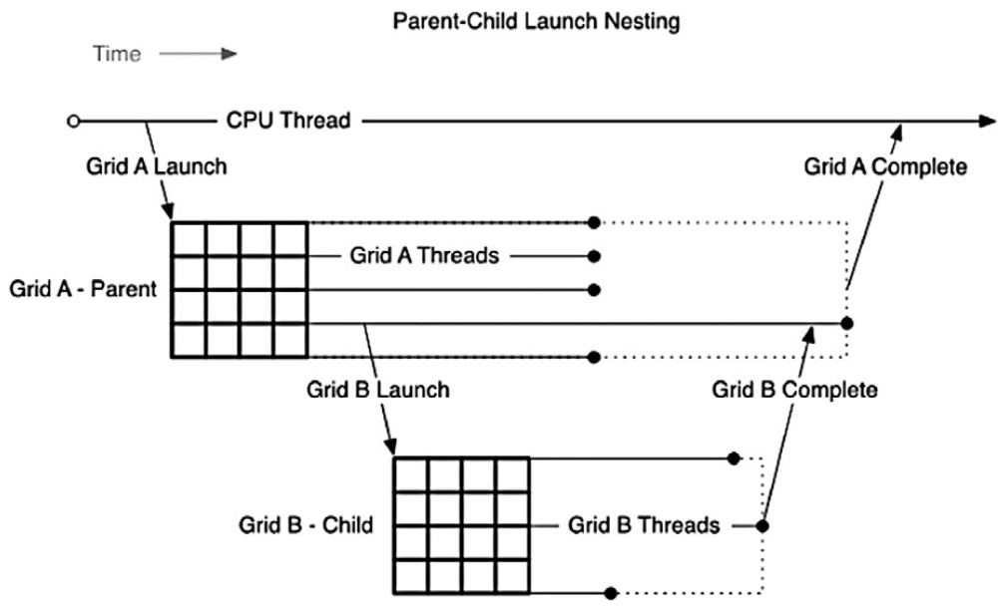
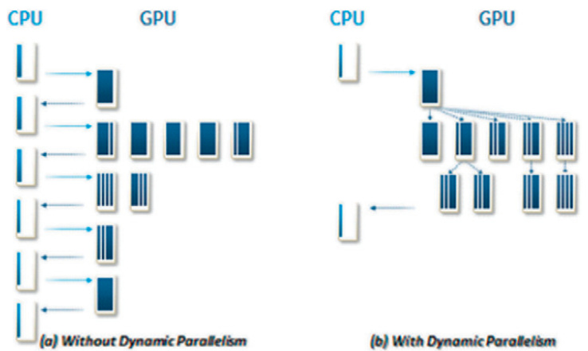

## Dynamic Parallelism and CUDA Streams: A Deep Dive

### Introdução

Este capítulo explora o uso de **CUDA streams** em conjunto com o **dynamic parallelism**. O dynamic parallelism permite que kernels CUDA lancem outros kernels diretamente do dispositivo, oferecendo flexibilidade e potencial para otimizar algoritmos complexos. A utilização adequada de streams, identificados por `cudaStream_t`, é crucial para orquestrar a execução desses kernels lançados dinamicamente, permitindo sobreposição de tarefas e melhor aproveitamento dos recursos da GPU. Este capítulo detalhará como associar streams a lançamentos de kernel dentro de blocos de threads, explorando as implicações e melhores práticas para a programação CUDA.

### Conceitos Fundamentais

O parâmetro `S` (do tipo `cudaStream_t`), conforme mencionado em [^1], especifica o *stream* associado à chamada do kernel. Este stream determina a ordem em que as operações são executadas na GPU e permite a sobreposição de diferentes tarefas. Em um contexto de dynamic parallelism, onde os kernels são lançados a partir de outros kernels no dispositivo, o gerenciamento correto dos streams torna-se ainda mais importante.



**Escopo do Stream:** A restrição principal é que o *stream* deve ser alocado dentro do mesmo bloco de threads. Isso significa que cada bloco de threads pode ter seus próprios *streams* para gerenciar a execução dos kernels filhos lançados por ele. Se nenhum *stream* for especificado, o valor padrão é 0 [^1].

**Alocação de Streams:** Para criar um *stream*, utiliza-se a função `cudaStreamCreate`. A associação desse *stream* a um kernel lançado dinamicamente é feita especificando-o como o argumento `S` na configuração de lançamento do kernel.

**Exemplo:**
Suponha que temos um kernel pai chamado `parentKernel` que lança um kernel filho chamado `childKernel`. O código para ilustrar a associação de um *stream* seria algo como:

```c++
__global__ void parentKernel() {
  cudaStream_t stream;
  cudaStreamCreate(&stream);

  childKernel<<<gridSize, blockSize, 0, stream>>>(...);

  cudaStreamDestroy(stream);
}
```

Neste exemplo, um *stream* é criado dentro do `parentKernel`, e esse *stream* é usado para lançar `childKernel`. Após o lançamento do kernel filho, o *stream* é destruído usando `cudaStreamDestroy`.

**Implicações da escolha do Stream:**

*   **Concorrência:** Ao usar *streams* diferentes, é possível executar kernels de forma concorrente. Se `childKernel` for computacionalmente intensivo e rodar em um *stream* diferente do *stream* padrão (0), outras operações no *stream* padrão podem continuar a ser executadas enquanto `childKernel` está em execução.



*   **Sincronização:** A sincronização entre *streams* é fundamental para garantir a ordem correta de execução. As funções `cudaStreamSynchronize` e `cudaDeviceSynchronize` podem ser usadas para esperar que todas as operações em um determinado *stream* ou em todos os *streams* na GPU sejam concluídas, respectivamente.
*   **Default Stream:** Se o *stream* não for especificado, o kernel é lançado no *default stream* (stream 0). Todas as operações no *default stream* são executadas em ordem, e o *default stream* implicitamente sincroniza todas as operações CUDA.

**Considerações sobre Desempenho:**

*   O uso excessivo de *streams* pode levar à sobrecarga, especialmente se a granularidade das tarefas executadas em cada *stream* for muito pequena.
*   A alocação e destruição frequentes de *streams* podem introduzir latência. Reutilizar *streams* sempre que possível pode melhorar o desempenho.
*   Entender a dependência de dados entre os kernels lançados dinamicamente é crucial para determinar se eles podem ser executados concorrentemente em *streams* diferentes.


**Uso Avançado:**

Em cenários mais complexos, múltiplos *streams* podem ser usados dentro de um único bloco de threads para permitir a execução concorrente de diferentes partes de um algoritmo. Por exemplo, enquanto um kernel está escrevendo dados em memória global em um *stream*, outro kernel pode estar lendo dados dessa memória (após sincronização adequada) em outro *stream*. Essa técnica, conhecida como *double buffering*, pode melhorar significativamente o desempenho em aplicações com alta largura de banda de memória.

### Conclusão

O uso de CUDA streams em conjunto com dynamic parallelism oferece um poderoso mecanismo para orquestrar a execução de kernels complexos na GPU. Compreender as restrições, implicações e melhores práticas para o gerenciamento de streams é fundamental para aproveitar ao máximo o potencial do dynamic parallelism e otimizar o desempenho das aplicações CUDA. A capacidade de alocar *streams* dentro de blocos de threads, combinada com as técnicas de sincronização apropriadas, permite a criação de algoritmos altamente concorrentes e eficientes.

### Referências

[^1]: `S` (`cudaStream_t`) specifies the stream associated with the kernel call. The stream must be allocated within the same thread block and defaults to 0 if not provided.
<!-- END -->