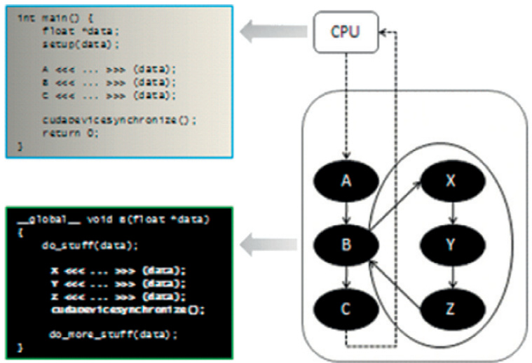

## Gerenciamento Virtualizado do Launch Pool Storage em CUDA

### Introdução

Este capítulo aprofunda-se no conceito de **Launch Pool Storage** no contexto da programação CUDA e GPUs. O Launch Pool Storage desempenha um papel crucial no rastreamento de kernels lançados e na otimização do desempenho, especialmente em ambientes onde a execução de kernels é frequente. Abordaremos como o Launch Pool Storage é virtualizado entre a memória do dispositivo e do host, e como a reserva de memória configurável no dispositivo contribui para melhorias significativas no desempenho.

### Conceitos Fundamentais

O **Launch Pool Storage** é um mecanismo interno da CUDA utilizado para gerenciar e rastrear os kernels que foram lançados na GPU [^7]. Semelhante a um *pool* de recursos, ele armazena informações sobre os kernels em execução, facilitando o gerenciamento e a sincronização.

**Virtualização entre Dispositivo e Host:**

A virtualização do Launch Pool Storage entre a memória do dispositivo e do host significa que tanto a CPU (host) quanto a GPU (dispositivo) podem acessar e modificar as informações armazenadas no pool. Essa característica permite uma coordenação eficiente entre o host e o dispositivo no que tange ao lançamento e à execução dos kernels. A virtualização implica que o *driver* CUDA gerencia a transferência de dados entre o host e o dispositivo, garantindo a consistência das informações.

**Configuração da Memória do Dispositivo:**

Um aspecto crucial para a otimização do Launch Pool Storage é a configuração da memória reservada no dispositivo [^7]. Alocar uma porção da memória do dispositivo especificamente para o Launch Pool Storage oferece as seguintes vantagens:

1.  **Redução da Latência:** Ao manter as informações sobre os kernels diretamente na memória da GPU, o tempo de acesso aos dados é significativamente menor do que se as informações estivessem armazenadas apenas na memória do host e precisassem ser transferidas.

2.  **Aumento da Largura de Banda:** O acesso local à memória do dispositivo permite uma maior largura de banda, otimizando as operações de leitura e escrita no Launch Pool Storage. Isso é particularmente relevante em aplicações onde o lançamento de kernels é uma operação frequente.

3.  **Diminuição da Sobrecarga:** A alocação dedicada de memória no dispositivo reduz a sobrecarga associada à comunicação entre o host e o dispositivo, liberando recursos para outras tarefas computacionais.

A quantidade de memória reservada para o Launch Pool Storage no dispositivo é configurável. Essa configuração permite que os desenvolvedores ajustem o tamanho do pool de acordo com as necessidades da aplicação. Um pool maior pode acomodar um número maior de kernels lançados simultaneamente, enquanto um pool menor pode economizar memória.

**Considerações Matemáticas:**

Embora a descrição fornecida não contenha equações específicas, podemos inferir algumas relações matemáticas relevantes:

*   **Tamanho do Launch Pool:** Seja $S$ o tamanho do Launch Pool Storage em bytes, $N$ o número de kernels que podem ser rastreados simultaneamente e $I$ o tamanho da informação armazenada para cada kernel. Então, $S \geq N \cdot I$.

*   **Tempo de Acesso:** Seja $T_d$ o tempo de acesso à memória do dispositivo e $T_h$ o tempo de acesso à memória do host. Dado que $T_d < T_h$, o uso do Launch Pool Storage na memória do dispositivo reduz o tempo total gasto no gerenciamento dos kernels.

**Exemplo Ilustrativo:**

Imagine uma aplicação de processamento de vídeo que lança múltiplos kernels para processar diferentes *frames* simultaneamente. Sem o Launch Pool Storage, o host precisaria rastrear o estado de cada kernel, o que envolveria frequentes transferências de dados entre o host e o dispositivo. Ao utilizar o Launch Pool Storage configurado na memória do dispositivo, a GPU pode gerenciar o estado dos kernels localmente, reduzindo drasticamente a sobrecarga de comunicação e melhorando o desempenho geral da aplicação.

**Desafios e Considerações:**

*   **Gerenciamento da Concorrência:** É crucial garantir a consistência dos dados no Launch Pool Storage em ambientes onde múltiplos *threads* acessam o pool simultaneamente. Mecanismos de sincronização, como *atomic operations* e *locks*, são necessários para evitar condições de corrida.

*   **Alocação Dinâmica:** Em cenários onde o número de kernels lançados varia dinamicamente, a alocação dinâmica de memória para o Launch Pool Storage pode ser necessária. No entanto, a alocação e desalocação frequentes podem introduzir uma sobrecarga adicional.
    A imagem a seguir descreve o comportamento de `cudaMalloc()` e `cudaFree()`.

    

*   **Otimização da Configuração:** A configuração ideal da memória reservada para o Launch Pool Storage depende das características da aplicação. É importante realizar *benchmarking* para determinar o tamanho ideal do pool que equilibra o desempenho e o consumo de memória.
     A imagem a seguir demonstra o aninhamento de kernel.

    

    A proxima imagem ilustra padrões de lançamento de kernel.

    

    A próxima imagem ilustra o lançamento de kernel pai-filho.

    

    A próxima imagem mostra exemplos válidos e inválidos de passagem de ponteiros.

    

    A seguinte imagem ilustra grades fixas vs dinâmicas.

    

### Conclusão

O Launch Pool Storage virtualizado entre a memória do dispositivo e do host representa uma otimização crucial na arquitetura CUDA para o gerenciamento eficiente de kernels lançados [^7]. A configuração da memória do dispositivo para o Launch Pool Storage oferece benefícios significativos em termos de latência, largura de banda e sobrecarga de comunicação. Ao compreender os conceitos e desafios associados ao Launch Pool Storage, os desenvolvedores podem projetar aplicações CUDA mais eficientes e escaláveis.

### Referências

[^7]: Launch pool storage, which tracks launched kernels, is virtualized between device and host memory. Configurable device memory is reserved for device-side launch pool storage to improve performance.
<!-- END -->