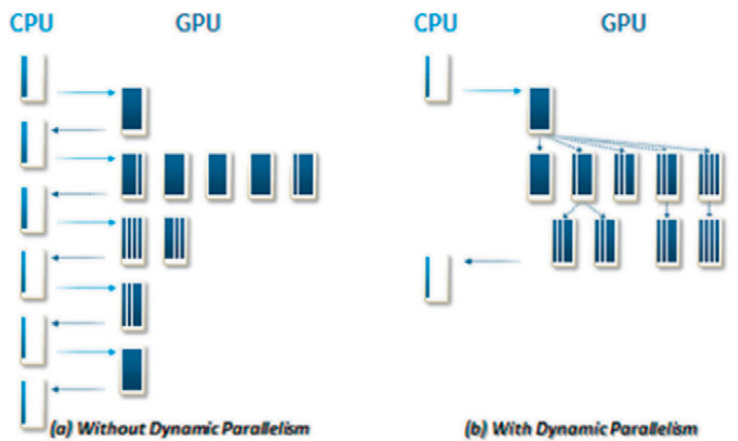
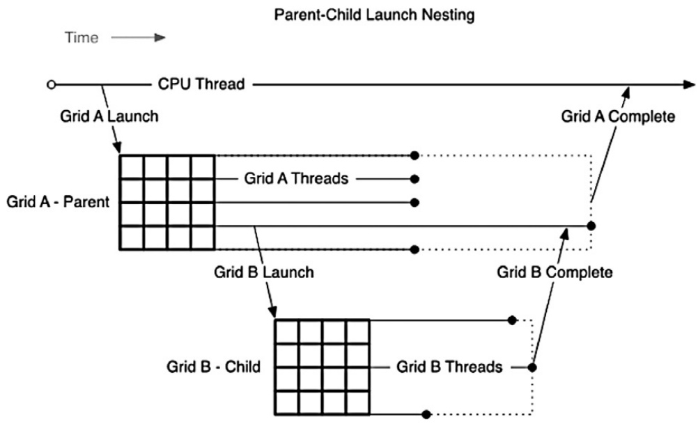
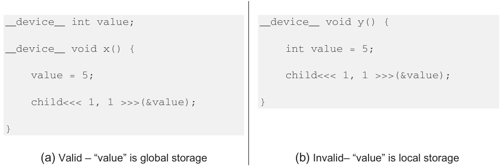

## Otimização de Cálculos de Curvas de Bézier com Paralelismo Dinâmico em CUDA

### Introdução

Este capítulo explora a aplicação do **paralelismo dinâmico (CDP)** em CUDA para otimizar o cálculo de curvas de Bézier. Expandindo os conceitos já apresentados de programação em GPU, focaremos em como a divisão da computação em kernels distintos pode levar a ganhos significativos de performance [^3]. A análise detalhada e implementação do paralelismo dinâmico no contexto específico do cálculo de curvas de Bézier fornecerá insights valiosos sobre as vantagens e desafios dessa técnica avançada.

### Conceitos Fundamentais

O cálculo de curvas de Bézier é uma tarefa computacionalmente intensiva, especialmente para curvas de alta ordem e com um grande número de segmentos. A abordagem tradicional, que executa todo o cálculo em um único kernel, pode se tornar gargalo devido à necessidade de coordenar e gerenciar o trabalho de forma eficiente. O paralelismo dinâmico oferece uma alternativa interessante, permitindo que os kernels lancem outros kernels diretamente da GPU, sem a necessidade de retornar para a CPU.

No contexto do cálculo de curvas de Bézier, o paralelismo dinâmico é implementado através da divisão da computação em dois kernels distintos [^3]: `computeBezierLineCDP()` e `computeBezierLinePositions()`.

1.  **`computeBezierLineCDP()`: Determinação da quantidade de trabalho.** A principal função deste kernel é analisar os pontos de controle da curva de Bézier e determinar a quantidade de trabalho necessária para tesselar cada segmento da curva. Em outras palavras, ele estima o número ideal de subsegmentos para cada parte da curva, com base em sua curvatura e complexidade. Este kernel atua como um "planejador", distribuindo o trabalho de forma adaptativa.

2.  **`computeBezierLinePositions()`: Execução da tesselação.** Este kernel recebe as informações geradas por `computeBezierLineCDP()` e efetivamente realiza o cálculo das posições dos pontos ao longo da curva de Bézier, ou seja, a tesselação. A tesselação envolve a avaliação da equação paramétrica da curva para diferentes valores do parâmetro *t*, gerando um conjunto de pontos que aproximam a curva.

A separação das tarefas permite uma melhor utilização dos recursos da GPU e pode levar a uma significativa melhoria de performance. O kernel `computeBezierLineCDP()` pode ser otimizado para determinar a quantidade de trabalho de forma eficiente, enquanto o kernel `computeBezierLinePositions()` pode focar na execução da tesselação em si.

**Vantagens do paralelismo dinâmico:**

*   **Adaptabilidade:** Permite ajustar dinamicamente a quantidade de trabalho para cada segmento da curva, otimizando a utilização dos recursos da GPU.
*   **Redução da sobrecarga da CPU:** Evita a necessidade de retornar à CPU para lançar novos kernels, reduzindo a latência e melhorando a performance geral.
*   **Paralelização mais eficiente:** Permite explorar o paralelismo em diferentes níveis, tanto na determinação da quantidade de trabalho quanto na execução da tesselação.

**Considerações de implementação:**

*   **Gerenciamento da memória:** É fundamental gerenciar a memória de forma eficiente, tanto para os dados de entrada (pontos de controle) quanto para os dados de saída (pontos da curva tesselação).

*   **Sincronização:** A sincronização entre os kernels é crucial para garantir a consistência dos dados e evitar condições de corrida.
*   **Overhead do lançamento de kernels:** O lançamento de kernels dinamicamente tem um overhead associado, que deve ser considerado ao avaliar os ganhos de performance.

### Conclusão

A utilização do paralelismo dinâmico para otimizar o cálculo de curvas de Bézier representa uma técnica avançada que pode levar a ganhos significativos de performance. Ao dividir a computação em dois kernels distintos, `computeBezierLineCDP()` e `computeBezierLinePositions()`, é possível adaptar dinamicamente a quantidade de trabalho para cada segmento da curva e reduzir a sobrecarga da CPU [^3]. A implementação eficiente do paralelismo dinâmico requer uma cuidadosa consideração do gerenciamento da memória, sincronização e overhead do lançamento de kernels. A aplicação bem-sucedida desta técnica demonstra o poder da programação em CUDA para resolver problemas complexos de computação gráfica.

### Referências

[^3]: Informação sobre a divisão da computação em dois kernels: `computeBezierLineCDP()` e `computeBezierLinePositions()`.

<!-- END -->